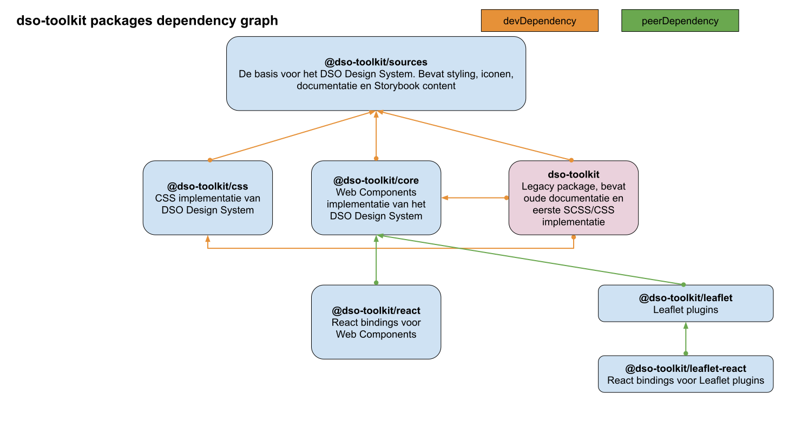

# DSO Toolkit architecture

Dit document beschrijft de visie en architectuur van het DSO Toolkit Design System.

Het begint met een samenvatting waarna per onderdeel een uitgebreide beschrijving volgt.

## Synopsis

De DSO Toolkit is een Design System en bestaat uit de volgende NPM packages:

- `dso-toolkit`
- `@dso-toolkit/core`
- `@dso-toolkit/react`
- `@dso-toolkit/angular`

## Termen

- **implementatie**: Binnen de context van de toolkit bedoelen we hier een _type uitvoering_: Een component heeft één of meerdere implementaties: HTML/CSS component, Web Component, React Component, Angular Component. Buiten de context van de toolkit kan een afnemer van de toolkit een component binnen zijn applicatie implementeren.
- **maintainer**: Een maintainer beheert de codebase van de DSO Toolkit.
- **component**: De DSO Toolkit maakt geen gebruik van een methode zoals Atomic Design: Binnen de toolkit is alles een component. Van een heading zoals `h1` tot een complexe werkvorm zoals Accordion.
- **afnemer**: Een applicatie / developer die componenten / onderdelen van de toolkit gebruikt.

### Implementatie details

Per component wordt in `readme.md` functionele documentatie bijgehouden.

### Styling

De styling van de toolkit wordt in SCSS geschreven. Vanuit `dso-toolkit` bieden we de globale (basis) en component styling aan.

### Component model

Per component is er een model (TypeScript interface) waar de functionaliteit in code wordt vastgelegd. Dit model is het contract waar implementaties aan moeten voldoen. Dit is een implementatie- en Storybook agnostisch model.

Componenten waarvan een web component aanwezig is hanteren de `dso` prefix voor events. Bijvoorbeeld `dsoRemove` of `dsoChange`.

### Storybook definities

Per component staat de Storybook definitie in `storybook/src/components/<component>/`, geschreven in native CSF:

- `<component>.models.ts`: het component model.
- `<component>.args.ts`: de args en argTypes, plus de mapper die args naar het model vertaalt.
- `<component>.content.ts`: demo- en dummy content. Content is altijd een functie, ook zonder parameter, zodat elke story en elke render verse objecten krijgt. Id's in content zijn vaste, leesbare strings.
- `<component>.template.ts`: de lit-html template. Heeft een template een ander component nodig, dan importeert die de template daarvan, zodat er per component één bron blijft.
- `<component>.stories.ts`: de meta met titel, argTypes, args en render, en per story een named export met alleen wat afwijkt.

Een nieuw component genereer je met `npx plop new-stencil-component`.

### Storybook args

Vanuit Storybook kan een component worden bediend en content worden aangeboden. Deze functie is het koppelvlak tussen demo/dummy content uit `<component>.content.ts` en Storybook Controls. De mapper `function componentArgsMapper(args: ComponentArgs)` kan voor simpele werkvormen soms overbodig voelen. Mochten de `ComponentModel` en `ComponentArgs` overeenkomen kan er gebruik gemaakt worden van de object spread shorthand `return { ...args };`. De signature wordt dan: `function componentArgsMapper(args: ComponentArgs): Required<ComponentModel>`.

## Storybook

De componenten staan in één Storybook (`storybook/`). De HTML/CSS-componenten en de Web Components staan daar naast elkaar. De React- en Angular-bindings hebben geen eigen Storybook.

### HTML/CSS components

De HTML/CSS componenten worden met `lit-html` gedocumenteerd.

### Web Components

Web Components schrijven we in TypeScript met [Stencil](https://stenciljs.com/).

### React Components

React Components worden gegenereerd door Stencil. Voor elke Web Component wordt er een binding component gegenereerd waarmee de React developer (afnemer) op een vertrouwde manier met de DSO Toolkit Web Components kan werken.

### Angular Components

Angular Components worden, net als de React Components, gegenereerd door Stencil. Het package `@dso-toolkit/angular` bevat voor elke Web Component een proxy-component, zodat de Angular developer (afnemer) de Web Components met Angular-bindings kan gebruiken.

## Docusaurus

Docusaurus is ons documentatie platform. In Docusaurus zijn componenten geschreven waarmee een Story kan worden ingeladen. Daarnaast is er nog een maatwerk `VersionSelector` en `AllVersions` component.
