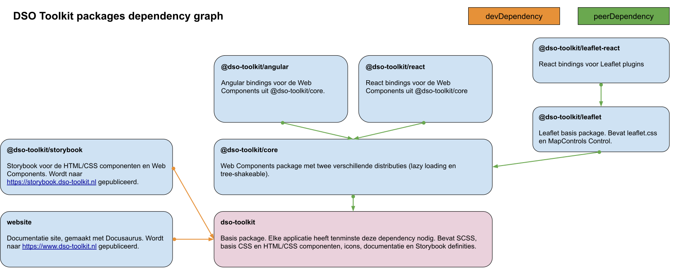

# DSO Toolkit architecture

Dit document beschrijft de visie en architectuur van het DSO Toolkit Design System.

Het begint met een samenvatting waarna per onderdeel een uitgebreide beschrijving volgt.

## Synopsis

De DSO Toolkit is een Design System en bestaat uit de volgende NPM packages:

- `dso-toolkit`
- `@dso-toolkit/core`
- `@dso-toolkit/react`
- `@dso-toolkit/angular`
- `@dso-toolkit/leaflet`
- `@dso-toolkit/react-leaflet`

## Termen

- **implementatie**: Binnen de context van de toolkit bedoelen we hier een _type uitvoering_: Een component heeft één of meerdere implementaties: HTML/CSS component, Web Component, React Component, Angular Component. Buiten de context van de toolkit kan een afnemer van de toolkit een component binnen zijn applicatie implementeren.
- **maintainer**: Een maintainer beheert de codebase van de DSO Toolkit.
- **component**: De DSO Toolkit maakt geen gebruik van een methode zoals Atomic Design: Binnen de toolkit is alles een component. Van een heading zoals `h1` tot een complexe werkvorm zoals Accordion.
- **afnemer**: Een applicatie / developer die componenten / onderdelen van de toolkit gebruikt.

### Implementatie details

Per component wordt in `readme.md` functionele documentatie bijgehouden.

### Styling

De styling van de toolkit wordt in SCSS geschreven. Vanuit `dso-toolkit` bieden we de globale (basis) en component styling aan.

### Component model

Per component is er een model (TypeScript interface) waar de functionaliteit in code wordt vastgelegd. Dit model is het contract waar implementaties aan moeten voldoen. Dit is een implementatie- en Storybook agnostisch model.

Componenten waarvan een web component aanwezig is hanteren de `dso` prefix voor events. Bijvoorbeeld `dsoRemove` of `dsoChange`.

### Storybook definities

Per component wordt de Storybook definitie bijgehouden. In de basis is dit een `export function storiesOfComponent(storybookParameters, componentParameters)`:

- `storybookParameters` is een component-overstijgend model voor de basis functionaliteit van Storybook.
- `componentParameters` is een component specifiek model. Over het algemeen zal dit alleen om de implementatie-specifieke template van het component gaan, maar voor complexe werkvormen kan dit uitgebreid worden om de documentatie te verbeteren.

Met deze opzet worden implementaties geforceerd identieke varianten op te leveren.

### Storybook args

Vanuit Storybook kan een component worden bediend en content worden aangeboden. Deze functie is het koppelvlak tussen demo/dummy content uit `<component>.content.ts` en Storybook Controls. De mapper `function componentArgsMapper(args: ComponentArgs)` kan voor simpele werkvormen soms overbodig voelen. Mochten de `ComponentModel` en `ComponentArgs` overeenkomen kan er gebruik gemaakt worden van de object spread shorthand `return { ...args };`. De signature wordt dan: `function componentArgsMapper(args: ComponentArgs): Required<ComponentModel>`.

## Storybook

De diverse implementaties van de DSO Toolkit componenten worden ieder in een eigen Storybook getoond.

### HTML/CSS components

De HTML/CSS componenten worden met `lit-html` gedocumenteerd.

### Web Components

Web Components schrijven we in TypeScript met [Stencil](https://stenciljs.com/).

### React Components

React Components worden gegenereerd door Stencil. Voor elke Web Component wordt er een binding component gegenereerd waarmee de React developer (afnemer) op een vertrouwde manier met de DSO Toolkit Web Components kan werken.

### Angular Components

We leveren geen Angular componenten. Angular heeft first class support voor Web Componenten. Voor meer informatie, zie de [Stencil documentatie](https://github.com/ionic-team/stencil-site/blob/f9289b0d52b13576b2dfcbdf4166e5f1aebb33e2/src/docs/framework-integration/angular.md#angular). Het hoofdstuk "Bindings" is niet van toepassing.

## Docusaurus

Docusaurus is ons documentatie platform. In Docusaurus zijn componenten geschreven waarmee een Story kan worden ingeladen. Daarnaast is er nog een maatwerk `VersionSelector` en `AllVersions` component.
