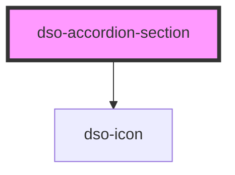

# dso-accordion-section

<!-- Auto Generated Below -->

## Properties

| Property  | Attribute | Description | Type      | Default |
| --------- | --------- | ----------- | --------- | ------- |
| `danger`  | `danger`  |             | `boolean` | `false` |
| `info`    | `info`    |             | `boolean` | `false` |
| `open`    | `open`    |             | `boolean` | `false` |
| `success` | `success` |             | `boolean` | `false` |
| `warning` | `warning` |             | `boolean` | `false` |

## Dependencies

### Depends on

- [dso-icon](../../icon)

### Graph

----------------------------------------------

*Built with [StencilJS](https://stenciljs.com/)*
