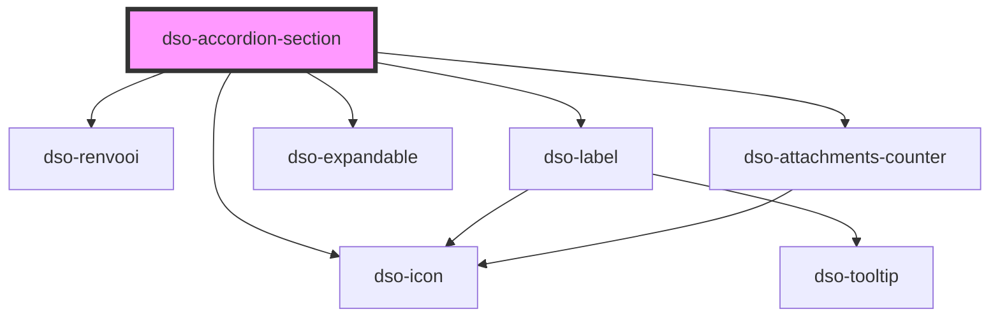

# `<dso-accordion-section>`

<!-- Auto Generated Below -->

## Properties

| Property                   | Attribute              | Description                                                                                | Type                                                                                                           | Default     |
| -------------------------- | ---------------------- | ------------------------------------------------------------------------------------------ | -------------------------------------------------------------------------------------------------------------- | ----------- |
| `attachmentCount`          | `attachment-count`     | `attachmentCount` takes precedence over `icon`                                             | `number \| undefined`                                                                                          | `undefined` |
| `handleTitle` _(required)_ | `handle-title`         | The title of the handle                                                                    | `string \| undefined \| { toegevoegd: string; } \| { verwijderd: string; } \| { was: string; wordt: string; }` | `undefined` |
| `handleUrl`                | `handle-url`           | When set the handle will render as a `<a>`. When undefined it renders as a `<button>`      | `string \| undefined`                                                                                          | `undefined` |
| `hasNestedAccordion`       | `has-nested-accordion` | Set when this Accordion Section contains or will contain an Accordion.                     | `boolean`                                                                                                      | `false`     |
| `heading`                  | `heading`              | Which heading element to use.                                                              | `"h2" \| "h3" \| "h4" \| "h5"`                                                                                 | `"h2"`      |
| `icon`                     | `icon`                 | To set an icon in the heading handle.                                                      | `string \| undefined`                                                                                          | `undefined` |
| `label`                    | `label`                | The label to be displayed in the heading handle inside a Label (optional)                  | `string \| undefined`                                                                                          | `undefined` |
| `labelStatus`              | `label-status`         | The status of the Label in the heading handle (optional)                                   | `"attention" \| "bright" \| "danger" \| "error" \| "info" \| "primary" \| "success" \| "warning" \| undefined` | `undefined` |
| `open`                     | `open`                 | Set the Accordion Section open.                                                            | `boolean`                                                                                                      | `false`     |
| `status`                   | `status`               | `state` takes precedence over `attachmentCount` and `icon`                                 | `"danger" \| "error" \| "info" \| "success" \| "warning" \| undefined`                                         | `undefined` |
| `statusDescription`        | `status-description`   | The status of the section.                                                                 | `string \| undefined`                                                                                          | `undefined` |
| `wijzigactie`              | `wijzigactie`          | An optional 'wijzigactie' that signals if the contents of the section is added or removed. | `"verwijder" \| "voegtoe" \| undefined`                                                                        | `undefined` |

## Events

| Event               | Description                                                              | Type                                               |
| ------------------- | ------------------------------------------------------------------------ | -------------------------------------------------- |
| `dsoAnimationEnd`   | Event emitted when the Accordion Section completes its toggle animation. | `CustomEvent<AccordionSectionAnimationEndEvent>`   |
| `dsoAnimationStart` | Event emitted when the Accordion Section starts its toggle animation.    | `CustomEvent<AccordionSectionAnimationStartEvent>` |
| `dsoToggleClick`    | Emitted when the user activates the toggle button.                       | `CustomEvent<AccordionSectionToggleClickEvent>`    |

## Methods

### `focusHandle() => Promise<void>`

Calling this method will set focus to the handle.

#### Returns

Type: `Promise<void>`

## Dependencies

### Depends on

- [dso-renvooi](../../renvooi)
- [dso-label](../../label)
- [dso-icon](../../icon)
- [dso-expandable](../../expandable)
- [dso-attachments-counter](../../attachments-counter)

### Graph

----------------------------------------------

*Built with [StencilJS](https://stenciljs.com/)*
