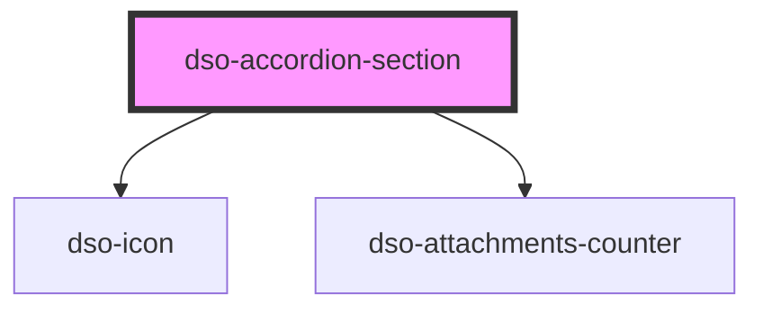

# dso-accordion-section

<!-- Auto Generated Below -->

## Properties

| Property          | Attribute          | Description | Type                                                        | Default     |
| ----------------- | ------------------ | ----------- | ----------------------------------------------------------- | ----------- |
| `attachmentCount` | `attachment-count` |             | `number \| undefined`                                       | `undefined` |
| `handleHref`      | `handle-href`      |             | `string \| undefined`                                       | `undefined` |
| `heading`         | `heading`          |             | `"h2" \| "h3" \| "h4" \| "h5"`                              | `'h2'`      |
| `icon`            | `icon`             |             | `string \| undefined`                                       | `undefined` |
| `open`            | `open`             |             | `boolean`                                                   | `false`     |
| `state`           | `state`            |             | `"danger" \| "info" \| "success" \| "warning" \| undefined` | `undefined` |
| `status`          | `status`           |             | `string \| undefined`                                       | `undefined` |

## Dependencies

### Depends on

- [dso-icon](../../icon)
- [dso-attachments-counter](../../attachments-counter)

### Graph

----------------------------------------------

*Built with [StencilJS](https://stenciljs.com/)*
