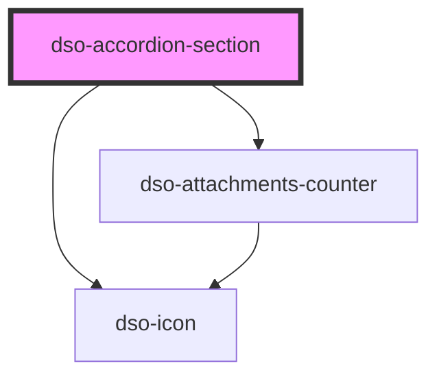

# dso-accordion-section

<!-- Auto Generated Below -->

## Properties

| Property          | Attribute          | Description                                                                           | Type                                                        | Default     |
| ----------------- | ------------------ | ------------------------------------------------------------------------------------- | ----------------------------------------------------------- | ----------- |
| `attachmentCount` | `attachment-count` | `attachmentCount` takes precedence over `icon`                                        | `number \| undefined`                                       | `undefined` |
| `handleTitle`     | `handle-title`     |                                                                                       | `string \| undefined`                                       | `undefined` |
| `handleUrl`       | `handle-url`       | When set the handle will render as a `<a>`. When undefined it renders as a `<button>` | `string \| undefined`                                       | `undefined` |
| `heading`         | `heading`          |                                                                                       | `"h2" \| "h3" \| "h4" \| "h5"`                              | `'h2'`      |
| `icon`            | `icon`             |                                                                                       | `string \| undefined`                                       | `undefined` |
| `open`            | `open`             |                                                                                       | `boolean`                                                   | `false`     |
| `state`           | `state`            | `state` takes precedence over `attachmentCount` and `icon`                            | `"danger" \| "info" \| "success" \| "warning" \| undefined` | `undefined` |
| `status`          | `status`           |                                                                                       | `string \| undefined`                                       | `undefined` |

## Methods

### `toggleSection(e?: MouseEvent | undefined) => Promise<void>`

Toggle a section. Pass the `<dso-accordion-section>` element or the index of the section.

#### Returns

Type: `Promise<void>`

## Dependencies

### Depends on

- [dso-icon](../../icon)
- [dso-attachments-counter](../../attachments-counter)

### Graph

----------------------------------------------

*Built with [StencilJS](https://stenciljs.com/)*
