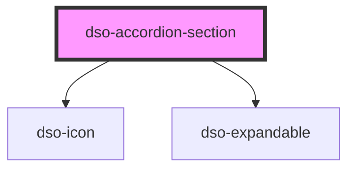

# `<dso-accordion-section>`

<!-- Auto Generated Below -->

## Properties

| Property          | Attribute          | Description                                                                           | Type                                                                   | Default     |
| ----------------- | ------------------ | ------------------------------------------------------------------------------------- | ---------------------------------------------------------------------- | ----------- |
| `attachmentCount` | `attachment-count` | `attachmentCount` takes precedence over `icon`                                        | `number \| undefined`                                                  | `undefined` |
| `handleTitle`     | `handle-title`     | The title of the handle                                                               | `string \| undefined`                                                  | `undefined` |
| `handleUrl`       | `handle-url`       | When set the handle will render as a `<a>`. When undefined it renders as a `<button>` | `string \| undefined`                                                  | `undefined` |
| `heading`         | `heading`          | Which heading element to use.                                                         | `"h2" \| "h3" \| "h4" \| "h5"`                                         | `"h2"`      |
| `icon`            | `icon`             | To set an icon in the heading handle.                                                 | `string \| undefined`                                                  | `undefined` |
| `open`            | `open`             | To open the Accordion Section.                                                        | `boolean`                                                              | `false`     |
| `state`           | `state`            | `state` takes precedence over `attachmentCount` and `icon`                            | `"danger" \| "error" \| "info" \| "success" \| "warning" \| undefined` | `undefined` |
| `status`          | `status`           | The status of the section.                                                            | `string \| undefined`                                                  | `undefined` |

## Methods

### `scrollSectionIntoView() => Promise<void>`

Scroll this section into view when needed.

#### Returns

Type: `Promise<void>`

## Dependencies

### Depends on

- [dso-icon](../../icon)
- [dso-expandable](../../expandable)

### Graph

----------------------------------------------

*Built with [StencilJS](https://stenciljs.com/)*
