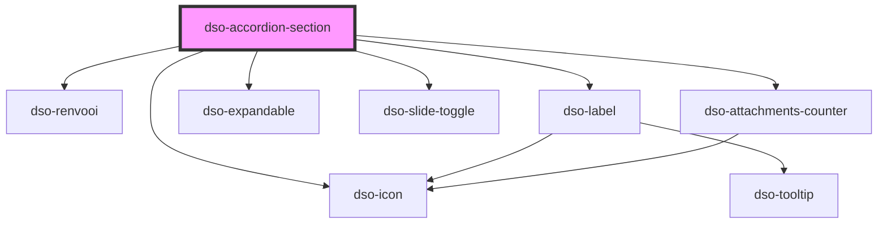

# `<dso-accordion-section>`

<!-- Auto Generated dso-toolkit -->

## Types

### AccordionHeading

```typescript
export type AccordionHeading = "h2" | "h3" | "h4" | "h5";
```

<!-- src/components/accordion/components/accordion-section.interfaces.ts::AccordionHeading -->

### AccordionSectionActiveChangeEvent

```typescript
export interface AccordionSectionActiveChangeEvent {
  /**
   * De current status van de Accordion Section.
   */
  current: boolean;

  /**
   * De desired status van de Accordion Section.
   */
  next: boolean;

  originalEvent: Event;
}
```

<!-- src/components/accordion/components/accordion-section.interfaces.ts::AccordionSectionActiveChangeEvent -->

### AccordionSectionAnimationEndEvent

```typescript
export interface AccordionSectionAnimationEndEvent {
  /**
   * Helper function to scroll the Accordion Section into view.
   */
  scrollIntoView(behavior?: ScrollBehavior): void;

  /**
   * The state of the Accordion Section after animation.
   */
  open: boolean;
}
```

<!-- src/components/accordion/components/accordion-section.interfaces.ts::AccordionSectionAnimationEndEvent -->

### AccordionSectionAnimationStartEvent

```typescript
export interface AccordionSectionAnimationStartEvent {
  /**
   * Helper function to scroll the Accordion Section into view.
   */
  scrollIntoView(behavior?: ScrollBehavior): void;

  /**
   * Whether or not the Accordion opening or closing.
   */
  animation: "opening" | "closing";
}
```

<!-- src/components/accordion/components/accordion-section.interfaces.ts::AccordionSectionAnimationStartEvent -->

### AccordionSectionState

```typescript
export type AccordionSectionState = "success" | "info" | "warning" | "danger" | "error";
```

<!-- src/components/accordion/components/accordion-section.interfaces.ts::AccordionSectionState -->

### AccordionSectionToggleClickEvent

```typescript
export interface AccordionSectionToggleClickEvent {
  /**
   * The original MouseEvent that triggered the click.
   *
   * In case the Section Handle is an <a> this event can be used to preventDefault() so the framework router is reponsible for navigating the user.
   */
  originalEvent?: MouseEvent;

  /**
   * The requested state. If the Accordion Section is closed, `open = true`.
   */
  open: boolean;
}
```

<!-- src/components/accordion/components/accordion-section.interfaces.ts::AccordionSectionToggleClickEvent -->

### AccordionSectionWijzigactie

```typescript
export type AccordionSectionWijzigactie = "voegtoe" | "verwijder";
```

<!-- src/components/accordion/components/accordion-section.interfaces.ts::AccordionSectionWijzigactie -->

### LabelStatus

```typescript
export type LabelStatus = "primary" | "success" | "info" | "warning" | "error" | "bright" | "attention" | "filter";
```

<!-- src/components/label/label.interfaces.ts::LabelStatus -->

### RenvooiValue

```typescript
export type RenvooiValue = { toegevoegd: string } | { was: string; wordt: string } | { verwijderd: string } | string;
```

<!-- src/components/renvooi/renvooi.interfaces.ts::RenvooiValue -->

<!-- Auto Generated Below -->

## Properties

| Property                   | Attribute              | Description                                                                                                                                                                                                                         | Type                                                                                                                             | Default     |
| -------------------------- | ---------------------- | ----------------------------------------------------------------------------------------------------------------------------------------------------------------------------------------------------------------------------------- | -------------------------------------------------------------------------------------------------------------------------------- | ----------- |
| `activatable`              | `activatable`          | A boolean to indicate if the Accordion Section is capable of being activated. When `true` a Slide Toggle displays on the right in the heading handle (optional). Works only for `variant` `compact-black` and `reverseAlign` false. | `boolean`                                                                                                                        | `false`     |
| `active`                   | `active`               | A boolean to indicate if the Accordion Section is `active`. Only applicable when the Accordion Section is `activatable`.                                                                                                            | `boolean`                                                                                                                        | `false`     |
| `attachmentCount`          | `attachment-count`     | `attachmentCount` takes precedence over `icon`                                                                                                                                                                                      | `number \| undefined`                                                                                                            | `undefined` |
| `handleTitle` _(required)_ | `handle-title`         | The title of the handle                                                                                                                                                                                                             | `RenvooiValue[] \| string \| undefined \| { toegevoegd: string; } \| { verwijderd: string; } \| { was: string; wordt: string; }` | `undefined` |
| `handleUrl`                | `handle-url`           | When set the handle will render as a `<a>`. When undefined it renders as a `<button>`                                                                                                                                               | `string \| undefined`                                                                                                            | `undefined` |
| `hasNestedAccordion`       | `has-nested-accordion` | Set when this Accordion Section contains or will contain an Accordion.                                                                                                                                                              | `boolean`                                                                                                                        | `false`     |
| `heading`                  | `heading`              | Which heading element to use.                                                                                                                                                                                                       | `"h2" \| "h3" \| "h4" \| "h5"`                                                                                                   | `"h2"`      |
| `icon`                     | `icon`                 | To set an icon in the heading handle.                                                                                                                                                                                               | `string \| undefined`                                                                                                            | `undefined` |
| `label`                    | `label`                | The label to be displayed in the heading handle inside a Label (optional)                                                                                                                                                           | `string \| undefined`                                                                                                            | `undefined` |
| `labelStatus`              | `label-status`         | The status of the Label in the heading handle (optional)                                                                                                                                                                            | `"attention" \| "bright" \| "error" \| "filter" \| "info" \| "primary" \| "success" \| "warning" \| undefined`                   | `undefined` |
| `open`                     | `open`                 | Set the Accordion Section open.                                                                                                                                                                                                     | `boolean`                                                                                                                        | `false`     |
| `status`                   | `status`               | `state` takes precedence over `attachmentCount` and `icon`                                                                                                                                                                          | `"danger" \| "error" \| "info" \| "success" \| "warning" \| undefined`                                                           | `undefined` |
| `statusDescription`        | `status-description`   | The status of the section.                                                                                                                                                                                                          | `string \| undefined`                                                                                                            | `undefined` |
| `wijzigactie`              | `wijzigactie`          | An optional 'wijzigactie' that signals if the section is added or removed.                                                                                                                                                          | `"verwijder" \| "voegtoe" \| undefined`                                                                                          | `undefined` |

## Events

| Event               | Description                                                               | Type                                               |
| ------------------- | ------------------------------------------------------------------------- | -------------------------------------------------- |
| `dsoActiveChange`   | An optional event listener for changes on the value of property `active`. | `CustomEvent<AccordionSectionActiveChangeEvent>`   |
| `dsoAnimationEnd`   | Event emitted when the Accordion Section completes its toggle animation.  | `CustomEvent<AccordionSectionAnimationEndEvent>`   |
| `dsoAnimationStart` | Event emitted when the Accordion Section starts its toggle animation.     | `CustomEvent<AccordionSectionAnimationStartEvent>` |
| `dsoToggleClick`    | Emitted when the user activates the toggle button.                        | `CustomEvent<AccordionSectionToggleClickEvent>`    |

## Methods

### `focusHandle() => Promise<void>`

Calling this method will set focus to the handle.

#### Returns

Type: `Promise<void>`

## Dependencies

### Depends on

- [dso-renvooi](../../renvooi)
- [dso-label](../../label)
- [dso-icon](../../icon)
- [dso-expandable](../../expandable)
- [dso-slide-toggle](../../slide-toggle)
- [dso-attachments-counter](../../attachments-counter)

### Graph



---

_Built with [StencilJS](https://stenciljs.com/)_
