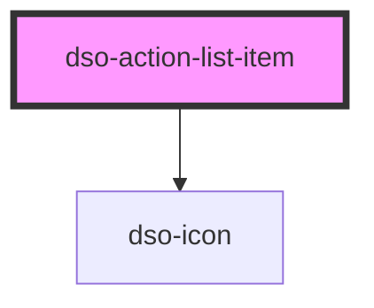

# dso-action-list-item

<!-- Auto Generated Below -->

## Properties

| Property            | Attribute    | Description                                     | Type                  | Default     |
| ------------------- | ------------ | ----------------------------------------------- | --------------------- | ----------- |
| `divider`           | `divider`    | Places a dashed line at the bottom of the item. | `boolean`             | `false`     |
| `flowLine`          | `flow-line`  | Show flow line to next step                     | `boolean`             | `false`     |
| `itemTitle`         | `item-title` |                                                 | `string \| undefined` | `undefined` |
| `step` _(required)_ | `step`       |                                                 | `number`              | `undefined` |
| `warning`           | `warning`    |                                                 | `boolean`             | `false`     |

## Dependencies

### Depends on

- [dso-icon](../../icon)

### Graph

----------------------------------------------

*Built with [StencilJS](https://stenciljs.com/)*
