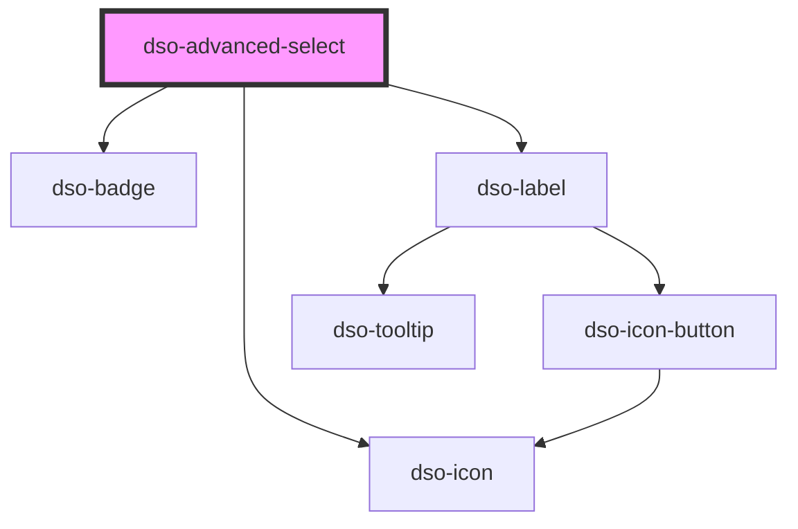

# `<dso-advanced-select>`

<!-- Auto Generated Below -->

## Properties

| Property     | Attribute     | Description                                                               | Type                                       | Default     |
| ------------ | ------------- | ------------------------------------------------------------------------- | ------------------------------------------ | ----------- |
| `active`     | `active`      | The active option. By object reference.                                   | `AdvancedSelectOption<never> \| undefined` | `undefined` |
| `activeHint` | `active-hint` | An extra text for the active option. Only visible in the list of options. | `string \| undefined`                      | `undefined` |
| `options`    | `options`     | The options to display in the select.                                     | `AdvancedSelectOptionOrGroup<never>[]`     | `[]`        |

## Events

| Event         | Description                                        | Type                                            |
| ------------- | -------------------------------------------------- | ----------------------------------------------- |
| `dsoChange`   | Emitted when user selects an option                | `CustomEvent<AdvancedSelectChangeEvent<never>>` |
| `dsoRedirect` | Emitted when user activates a group redirect link. | `CustomEvent<AdvancedSelectRedirectEvent>`      |

## Dependencies

### Depends on

- [dso-badge](../badge)
- [dso-icon](../icon)
- [dso-label](../label)

### Graph

----------------------------------------------

*Built with [StencilJS](https://stenciljs.com/)*
