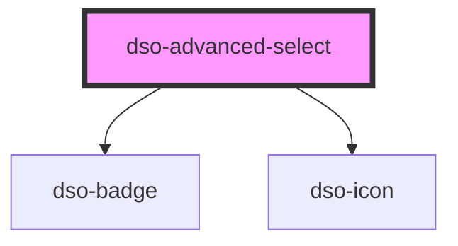

# `<dso-advanced-select>`

<!-- Auto Generated Below -->

## Properties

| Property  | Attribute | Description                             | Type                                     | Default     |
| --------- | --------- | --------------------------------------- | ---------------------------------------- | ----------- |
| `active`  | --        | The active option. By object reference. | `AdvancedSelectOption<any> \| undefined` | `undefined` |
| `open`    | `open`    | The open state of the options list.     | `boolean \| undefined`                   | `undefined` |
| `options` | --        | The options to display in the select.   | `AdvancedSelectOptionsOrGroup<any>[]`    | `[]`        |

## Events

| Event            | Description                          | Type                                          |
| ---------------- | ------------------------------------ | --------------------------------------------- |
| `dsoClick`       | Emitted when user clicks the select. | `CustomEvent<AdvancedSelectClickEvent>`       |
| `dsoOptionClick` | Emitted when user clicks an option   | `CustomEvent<AdvancedSelectOptionClickEvent>` |

## Dependencies

### Depends on

- [dso-badge](../badge)
- [dso-icon](../icon)

### Graph

----------------------------------------------

*Built with [StencilJS](https://stenciljs.com/)*
