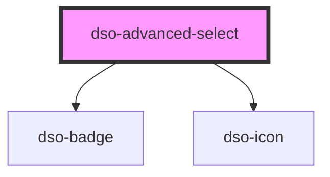

# `<dso-advanced-select>`

<!-- Auto Generated Below -->

## Properties

| Property     | Attribute     | Description                                                               | Type                                       | Default     |
| ------------ | ------------- | ------------------------------------------------------------------------- | ------------------------------------------ | ----------- |
| `active`     | --            | The active option. By object reference.                                   | `AdvancedSelectOption<never> \| undefined` | `undefined` |
| `activeHint` | `active-hint` | An extra text for the active option. Only visible in the list of options. | `string \| undefined`                      | `undefined` |
| `options`    | --            | The options to display in the select.                                     | `AdvancedSelectOptionOrGroup<never>[]`     | `[]`        |

## Events

| Event              | Description                               | Type                                                 |
| ------------------ | ----------------------------------------- | ---------------------------------------------------- |
| `dsoOptionClick`   | Emitted when user clicks an option        | `CustomEvent<AdvancedSelectOptionClickEvent<never>>` |
| `dsoRedirectClick` | Emitted when user clicks a redirect link. | `CustomEvent<AdvancedSelectRedirectClickEvent>`      |

## Dependencies

### Depends on

- [dso-badge](../badge)
- [dso-icon](../icon)

### Graph

----------------------------------------------

*Built with [StencilJS](https://stenciljs.com/)*
