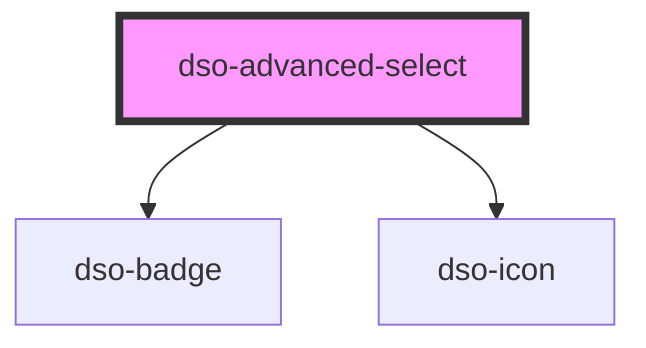

# `<dso-advanced-select>`

<!-- Auto Generated Below -->

## Properties

| Property  | Attribute | Description                             | Type                                         | Default     |
| --------- | --------- | --------------------------------------- | -------------------------------------------- | ----------- |
| `active`  | --        | The active option. By object reference. | `AdvancedSelectOption<unknown> \| undefined` | `undefined` |
| `open`    | `open`    | The open state of the options list.     | `boolean`                                    | `false`     |
| `options` | --        | The options to display in the select.   | `AdvancedSelectOptionsOrGroup<unknown>[]`    | `[]`        |

## Events

| Event              | Description                               | Type                                            |
| ------------------ | ----------------------------------------- | ----------------------------------------------- |
| `dsoClick`         | Emitted when user clicks the select.      | `CustomEvent<AdvancedSelectClickEvent>`         |
| `dsoOptionClick`   | Emitted when user clicks an option        | `CustomEvent<AdvancedSelectOptionClickEvent>`   |
| `dsoRedirectClick` | Emitted when user clicks a redirect link. | `CustomEvent<AdvancedSelectRedirectClickEvent>` |

## Dependencies

### Depends on

- [dso-badge](../badge)
- [dso-icon](../icon)

### Graph

----------------------------------------------

*Built with [StencilJS](https://stenciljs.com/)*
