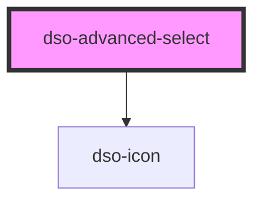

# `<dso-advanced-select>`

<!-- Auto Generated Below -->

## Properties

| Property  | Attribute | Description                             | Type                                | Default     |
| --------- | --------- | --------------------------------------- | ----------------------------------- | ----------- |
| `active`  | --        | The active option. By object reference. | `AdvancedSelectOption \| undefined` | `undefined` |
| `open`    | `open`    | The open state of the options list.     | `boolean \| undefined`              | `undefined` |
| `options` | --        | The options to display in the select.   | `AdvancedSelectOptionsOrGroup[]`    | `[]`        |

## Dependencies

### Depends on

- [dso-icon](../icon)

### Graph

----------------------------------------------

*Built with [StencilJS](https://stenciljs.com/)*
