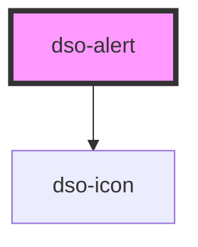

# `<dso-alert>`

<!-- Auto Generated Below -->

## Properties

| Property              | Attribute    | Description                                                                                                          | Type                                           | Default     |
| --------------------- | ------------ | -------------------------------------------------------------------------------------------------------------------- | ---------------------------------------------- | ----------- |
| `roleAlert`           | `role-alert` | Whether or not to show the role attribute with value "alert". To control the tooltip add the `role-alert` attribute. | `boolean \| undefined`                         | `undefined` |
| `status` _(required)_ | `status`     | Set status of alert                                                                                                  | `"danger" \| "info" \| "success" \| "warning"` | `undefined` |

## Dependencies

### Depends on

- [dso-icon](../icon)

### Graph

----------------------------------------------

*Built with [StencilJS](https://stenciljs.com/)*
