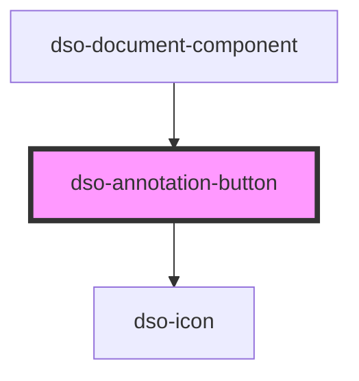

# `<dso-annotation-button>`

<!-- Auto Generated Below -->

## Properties

| Property                  | Attribute    | Description                                                                                                  | Type                  | Default     |
| ------------------------- | ------------ | ------------------------------------------------------------------------------------------------------------ | --------------------- | ----------- |
| `identifier` _(required)_ | `identifier` | To link the Annotation Button with `aria-controls` to a different element, most likely an Annotation Output. | `string \| undefined` | `undefined` |
| `open`                    | `open`       | Set to true when the annotation is open.                                                                     | `boolean`             | `false`     |

## Events

| Event      | Description                             | Type                                      |
| ---------- | --------------------------------------- | ----------------------------------------- |
| `dsoClick` | Emitted when user activates the button. | `CustomEvent<AnnotationButtonClickEvent>` |

## Dependencies

### Used by

 - [dso-document-component](../document-component)

### Depends on

- [dso-icon](../icon)

### Graph

----------------------------------------------

*Built with [StencilJS](https://stenciljs.com/)*
