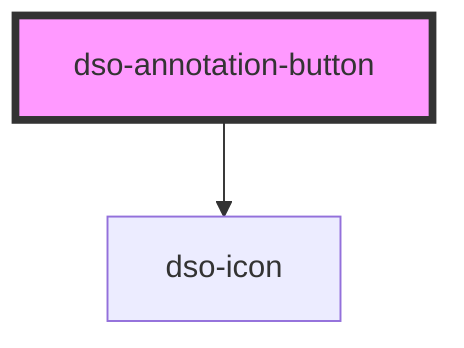

# `<dso-annotation-button>`

<!-- Auto Generated Below -->

## Properties

| Property                  | Attribute    | Description                                                                                                  | Type     | Default     |
| ------------------------- | ------------ | ------------------------------------------------------------------------------------------------------------ | -------- | ----------- |
| `identifier` _(required)_ | `identifier` | To link the Annotation Button with `aria-controls` to a different element, most likely an Annotation Output. | `string` | `undefined` |

## Dependencies

### Depends on

- [dso-icon](../icon)

### Graph

----------------------------------------------

*Built with [StencilJS](https://stenciljs.com/)*
