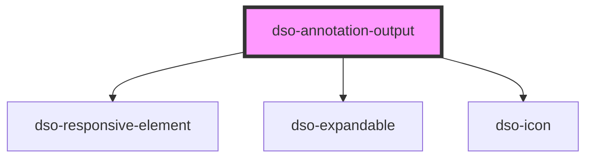

# `<dso-annotation-output>`

<!-- Auto Generated Below -->

## Properties

| Property                  | Attribute           | Description                                                                        | Type                  | Default     |
| ------------------------- | ------------------- | ---------------------------------------------------------------------------------- | --------------------- | ----------- |
| `annotationPrefix`        | `annotation-prefix` | This text will be displayed above the annotation-output when opened                | `string \| undefined` | `undefined` |
| `identifier` _(required)_ | `identifier`        | The annotation-button that toggles this component should have the same identifier. | `string`              | `undefined` |

## Events

| Event       | Description | Type                                 |
| ----------- | ----------- | ------------------------------------ |
| `dsoToggle` |             | `CustomEvent<AnnotationToggleEvent>` |

## Methods

### `toggleAnnotation(e: MouseEvent | KeyboardEvent, identifier: string) => Promise<void>`

#### Returns

Type: `Promise<void>`

## Dependencies

### Depends on

- [dso-responsive-element](../responsive-element)
- [dso-expandable](../expandable)
- [dso-icon](../icon)

### Graph

----------------------------------------------

*Built with [StencilJS](https://stenciljs.com/)*
