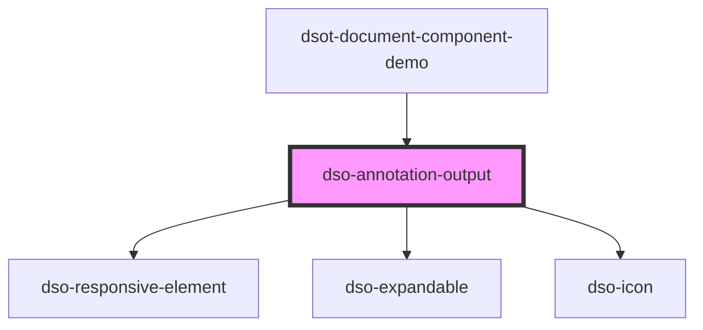

# `<dso-annotation-output>`

<!-- Auto Generated Below -->

## Properties

| Property                  | Attribute           | Description                                                                        | Type                  | Default     |
| ------------------------- | ------------------- | ---------------------------------------------------------------------------------- | --------------------- | ----------- |
| `annotationPrefix`        | `annotation-prefix` | This text will be displayed above the annotation-output when opened                | `string \| undefined` | `undefined` |
| `identifier` _(required)_ | `identifier`        | The annotation-button that toggles this component should have the same identifier. | `string`              | `undefined` |
| `open`                    | `open`              | Set to `true` to show content.                                                     | `boolean`             | `false`     |

## Events

| Event      | Description                                                          | Type                                      |
| ---------- | -------------------------------------------------------------------- | ----------------------------------------- |
| `dsoClose` | This event is emitted when the user activates the Annotation Button. | `CustomEvent<AnnotationOutputCloseEvent>` |

## Dependencies

### Used by

 - [dsot-document-component-demo](../document-component-demo)

### Depends on

- [dso-responsive-element](../responsive-element)
- [dso-expandable](../expandable)
- [dso-icon](../icon)

### Graph

----------------------------------------------

*Built with [StencilJS](https://stenciljs.com/)*
