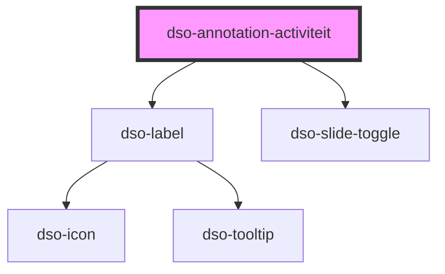

# dso-annotation-activiteit

<!-- Auto Generated Below -->

## Properties

| Property                      | Attribute                       | Description                                                                         | Type                                                                                                           | Default     |
| ----------------------------- | ------------------------------- | ----------------------------------------------------------------------------------- | -------------------------------------------------------------------------------------------------------------- | ----------- |
| `active`                      | `active`                        | Een optionele boolean die aangeeft of de annotatie actief is.                       | `boolean \| undefined`                                                                                         | `undefined` |
| `gewijzigdeLocatie`           | `gewijzigde-locatie`            | Een optionele boolean die aangeeft of de locatie van de annotatie gewijzigd is.     | `boolean \| undefined`                                                                                         | `undefined` |
| `locatieNoemers`              | --                              | De noemer van de locatie.                                                           | `(string \| AnnotationDiff)[] \| undefined`                                                                    | `undefined` |
| `naam`                        | `naam`                          | De naam van de activiteit.                                                          | `string \| undefined \| { toegevoegd: string; } \| { verwijderd: string; } \| { was: string; wordt: string; }` | `undefined` |
| `regelKwalificatie`           | `regel-kwalificatie`            | De activiteit regel kwalificatie.                                                   | `string \| undefined \| { toegevoegd: string; } \| { verwijderd: string; } \| { was: string; wordt: string; }` | `undefined` |
| `regelKwalificatieVoorzetsel` | `regel-kwalificatie-voorzetsel` | Voorzetsel van de regelKwalificatie. Exclusief dubbele punt.                        | `string \| undefined`                                                                                          | `undefined` |
| `symbool`                     | `symbool`                       | Een URL naar de verbeelding van de legenda.                                         | `string \| undefined`                                                                                          | `undefined` |
| `wijzigactie`                 | `wijzigactie`                   | Een optionele wijzigactie die aangeeft of de annotatie toegevoegd of verwijderd is. | `"verwijderd" \| "voegtoe" \| undefined`                                                                       | `undefined` |

## Events

| Event             | Description                                                                   | Type                                       |
| ----------------- | ----------------------------------------------------------------------------- | ------------------------------------------ |
| `dsoActiveChange` | Een optionele event listener voor wijzigingen aan de status van de annotatie. | `CustomEvent<AnnotationActiveChangeEvent>` |

## Dependencies

### Depends on

- [dso-label](../../label)
- [dso-slide-toggle](../../slide-toggle)

### Graph

----------------------------------------------

*Built with [StencilJS](https://stenciljs.com/)*
