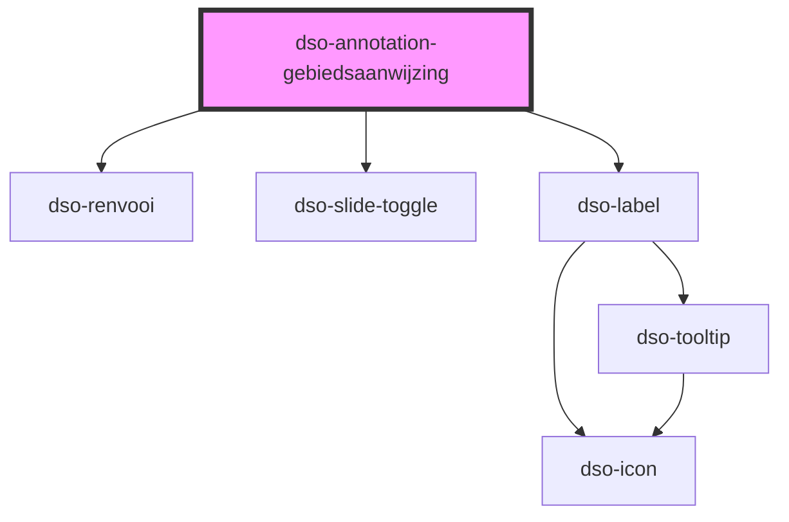

# `<dso-annotation-gebiedsaanwijzing>`

<!-- Auto Generated Below -->

## Properties

| Property            | Attribute            | Description                                                                         | Type                                                                                                           | Default     |
| ------------------- | -------------------- | ----------------------------------------------------------------------------------- | -------------------------------------------------------------------------------------------------------------- | ----------- |
| `active`            | `active`             | Een optionele boolean die aangeeft of de annotatie actief is.                       | `boolean \| undefined`                                                                                         | `undefined` |
| `gewijzigdeLocatie` | `gewijzigde-locatie` | Een optionele boolean die aangeeft of de locatie van de annotatie gewijzigd is.     | `boolean \| undefined`                                                                                         | `undefined` |
| `naam`              | `naam`               | De naam van de gebiedsaanwijzing.                                                   | `string \| undefined \| { toegevoegd: string; } \| { verwijderd: string; } \| { was: string; wordt: string; }` | `undefined` |
| `wijzigactie`       | `wijzigactie`        | Een optionele wijzigactie die aangeeft of de annotatie toegevoegd of verwijderd is. | `"verwijder" \| "voegtoe" \| undefined`                                                                        | `undefined` |

## Events

| Event             | Description                                                                   | Type                                       |
| ----------------- | ----------------------------------------------------------------------------- | ------------------------------------------ |
| `dsoActiveChange` | Een optionele event listener voor wijzigingen aan de status van de annotatie. | `CustomEvent<AnnotationActiveChangeEvent>` |

## Slots

| Slot        | Description                                             |
| ----------- | ------------------------------------------------------- |
| `"symbool"` | Een optionele afbeelding die de annotatie symboliseert. |

## Dependencies

### Depends on

- [dso-renvooi](../../renvooi)
- [dso-slide-toggle](../../slide-toggle)
- [dso-label](../../label)

### Graph

----------------------------------------------

*Built with [StencilJS](https://stenciljs.com/)*
