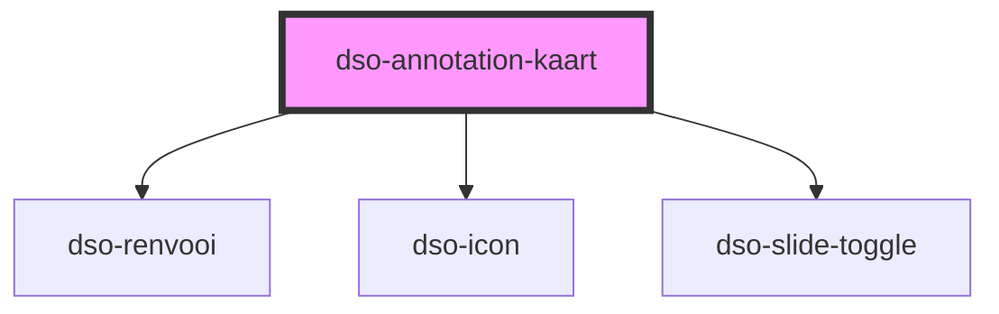

# `<dso-annotation-kaart>`

<!-- Auto Generated dso-toolkit -->

## Types

### AnnotationKaartClickEvent

```typescript
export interface AnnotationKaartClickEvent {
  href: string;
  originalEvent: MouseEvent;
  isModifiedEvent: boolean;
}
```

<!-- src/components/annotation/annotation-kaart/annotation-kaart.interfaces.ts::AnnotationKaartClickEvent -->

### AnnotationWijzigactie

```typescript
export type AnnotationWijzigactie = "voegtoe" | "verwijder";
```

<!-- src/components/annotation/annotation.interfaces.ts::AnnotationWijzigactie -->

### RenvooiValue

```typescript
export type RenvooiValue = { toegevoegd: string } | { was: string; wordt: string } | { verwijderd: string } | string;
```

<!-- src/components/renvooi/renvooi.interfaces.ts::RenvooiValue -->

<!-- Auto Generated Below -->

## Properties

| Property      | Attribute     | Description                                                                                   | Type                                                                                                           | Default     |
| ------------- | ------------- | --------------------------------------------------------------------------------------------- | -------------------------------------------------------------------------------------------------------------- | ----------- |
| `href`        | `href`        | De url naar de kaart. Gebruik het event `dsoClick` om de navigatie aan de router te koppelen. | `string \| undefined`                                                                                          | `undefined` |
| `naam`        | `naam`        | De naam van de kaart.                                                                         | `string \| undefined \| { toegevoegd: string; } \| { verwijderd: string; } \| { was: string; wordt: string; }` | `undefined` |
| `wijzigactie` | `wijzigactie` | Een optionele wijzigactie die aangeeft of de annotatie is toegevoegd of verwijderd.           | `"verwijder" \| "voegtoe" \| undefined`                                                                        | `undefined` |

## Events

| Event      | Description                                                                                                                                                       | Type                                     |
| ---------- | ----------------------------------------------------------------------------------------------------------------------------------------------------------------- | ---------------------------------------- |
| `dsoClick` | Event als de gebruiker de kaartnaam selecteert. Let op "isModifiedEvent" om te bepalen of de navigatieactie door de router of de browser moet worden afgehandeld. | `CustomEvent<AnnotationKaartClickEvent>` |

## Dependencies

### Depends on

- [dso-renvooi](../../renvooi)
- [dso-icon](../../icon)
- [dso-slide-toggle](../../slide-toggle)

### Graph



---

_Built with [StencilJS](https://stenciljs.com/)_
