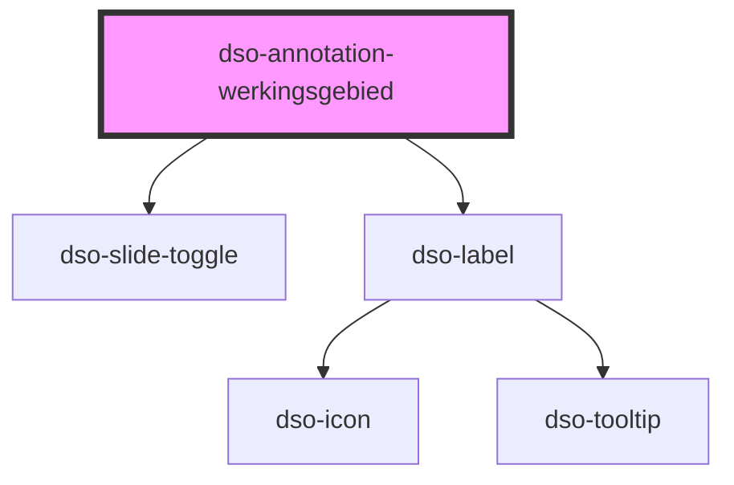

# dso-annotation-werkingsgebied

<!-- Auto Generated Below -->

## Properties

| Property            | Attribute            | Description                                                                         | Type                                        | Default     |
| ------------------- | -------------------- | ----------------------------------------------------------------------------------- | ------------------------------------------- | ----------- |
| `active`            | `active`             | Een optionele boolean die aangeeft of de annotatie actief is.                       | `boolean \| undefined`                      | `undefined` |
| `gewijzigdeLocatie` | `gewijzigde-locatie` | Een optionele boolean die aangeeft of de locatie van de annotatie gewijzigd is.     | `boolean \| undefined`                      | `undefined` |
| `locatieNoemers`    | --                   | De noemer van de locatie.                                                           | `(string \| AnnotationDiff)[] \| undefined` | `undefined` |
| `symbool`           | `symbool`            | Een URL naar de verbeelding van de legenda.                                         | `string \| undefined`                       | `undefined` |
| `wijzigactie`       | `wijzigactie`        | Een optionele wijzigactie die aangeeft of de annotatie toegevoegd of verwijderd is. | `"verwijderd" \| "voegtoe" \| undefined`    | `undefined` |

## Events

| Event             | Description                                                                   | Type                                       |
| ----------------- | ----------------------------------------------------------------------------- | ------------------------------------------ |
| `dsoActiveChange` | Een optionele event listener voor wijzigingen aan de status van de annotatie. | `CustomEvent<AnnotationActiveChangeEvent>` |

## Dependencies

### Depends on

- [dso-slide-toggle](../../slide-toggle)
- [dso-label](../../label)

### Graph

----------------------------------------------

*Built with [StencilJS](https://stenciljs.com/)*
