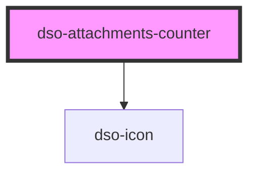

# `<dso-attachments-counter>`

<!-- Auto Generated Below -->

## Properties

| Property             | Attribute | Description                | Type     | Default     |
| -------------------- | --------- | -------------------------- | -------- | ----------- |
| `count` _(required)_ | `count`   | The number of attachments. | `number` | `undefined` |

## Dependencies

### Depends on

- [dso-icon](../icon)

### Graph

----------------------------------------------

*Built with [StencilJS](https://stenciljs.com/)*
