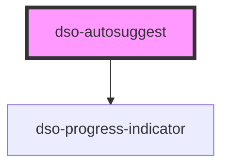

# `<dso-autosuggest>`

Dit custom element is een wrapper voor een `<input type="text">`.

Aan de hand van het debounced `dsoChange` event van `<dso-autosuggest>` of het `change` even van de slotted `<input type="text">` moet de afnemer de property `suggestions` voorzien van relevante suggesties `Suggestion[]`. Verder is de afnemer verantwoordelijk voor sortering op relevantie en het limiteren van het aantal suggesties.

Als de gebruiker een suggestie activeert wordt het event `dsoSelect` met het type `CustomEvent<Suggestion>` ge-emit.

### Naamgeving events

De events van dit Web Component heten `dsoChange` en `dsoSelect` omdat `change` en `select` native DOM events zijn waar Stencil.js een build warning voor afgeeft.

## Autosuggest en Search Bar

Search Bar is voorbereid op het gebruik van Autosuggest. Let op dat Search Bar een HTML/CSS component is en dat de afnemer zelf de eventuele "Zoekopdracht legen" knop moet aansluiten.

## Models

<!-- Keep in sync with autosuggest.tsx:Suggestion -->
```typescript
export interface Suggestion {
  /**
   * The text that will be displayed as the suggestion.
   */
  value: string;

  /**
   * The type of suggestion.
   */
  type?: string;

  /**
   * A reference to the original object that was used to create the suggestion.
   */
  item?: unknown;
}
```

<!-- Auto Generated Below -->


## Properties

| Property         | Attribute          | Description                                                                                                                                                                                                                                               | Type                   | Default                |
| ---------------- | ------------------ | --------------------------------------------------------------------------------------------------------------------------------------------------------------------------------------------------------------------------------------------------------- | ---------------------- | ---------------------- |
| `loading`        | `loading`          | Shows progress indicator when fetching results.                                                                                                                                                                                                           | `boolean`              | `false`                |
| `loadingDelayed` | `loading-delayed`  | To delay progress indicator showing (in ms).                                                                                                                                                                                                              | `number \| undefined`  | `undefined`            |
| `loadingLabel`   | `loading-label`    | To override progress indicator's default loading label.                                                                                                                                                                                                   | `string \| undefined`  | `"Een moment geduld."` |
| `notFoundLabel`  | `not-found-label`  | To show text when no results are found.                                                                                                                                                                                                                   | `string \| undefined`  | `undefined`            |
| `suggestOnFocus` | `suggest-on-focus` | Whether the previous suggestions will be presented when the input gets focus again.                                                                                                                                                                       | `boolean`              | `false`                |
| `suggestions`    | --                 | The suggestions for the value of the slotted input element. Optionally a Suggestion can have a `type` and `item`.  The `type` is used to style the suggestion. `item` can be use to reference the original object that was used to create the suggestion. | `Suggestion[] \| null` | `null`                 |


## Events

| Event       | Description                                                                                                             | Type                      |
| ----------- | ----------------------------------------------------------------------------------------------------------------------- | ------------------------- |
| `dsoChange` | This is emitted debounced for every change for the slotted input type=text element.                                     | `CustomEvent<string>`     |
| `dsoSearch` | Emitted when enter is pressed. The `detail` property of the `CustomEvent` will contain the input text.                  | `CustomEvent<string>`     |
| `dsoSelect` | Emitted when a suggestion is selected. The `detail` property of the `CustomEvent` will contain the selected suggestion. | `CustomEvent<Suggestion>` |


## Dependencies

### Depends on

- [dso-progress-indicator](../progress-indicator)

### Graph


----------------------------------------------

*Built with [StencilJS](https://stenciljs.com/)*
