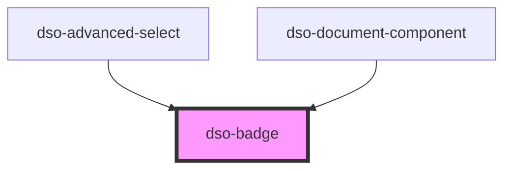

# `<dso-badge>`

<!-- Auto Generated dso-toolkit -->

## Types

### BadgeStatus

```typescript
export type BadgeStatus = "primary" | "success" | "info" | "warning" | "error" | "outline" | "attention";
```

<!-- src/components/badge/badge.interfaces.ts::BadgeStatus -->

<!-- Auto Generated Below -->

## Properties

| Property | Attribute | Description              | Type                                                                                                | Default     |
| -------- | --------- | ------------------------ | --------------------------------------------------------------------------------------------------- | ----------- |
| `status` | `status`  | The status of the Badge. | `"attention" \| "error" \| "info" \| "outline" \| "primary" \| "success" \| "warning" \| undefined` | `undefined` |

## Dependencies

### Used by

- [dso-advanced-select](../advanced-select)
- [dso-document-component](../document-component)

### Graph



---

_Built with [StencilJS](https://stenciljs.com/)_
