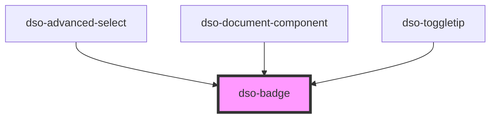

# `<dso-badge>`

<!-- Auto Generated Below -->

## Properties

| Property  | Attribute | Description                 | Type                                                                                                | Default     |
| --------- | --------- | --------------------------- | --------------------------------------------------------------------------------------------------- | ----------- |
| `active`  | `active`  | Show Badge in active state  | `boolean \| undefined`                                                                              | `undefined` |
| `hovered` | `hovered` | Show Badge in hovered state | `boolean \| undefined`                                                                              | `undefined` |
| `status`  | `status`  | The status of the Badge.    | `"attention" \| "error" \| "info" \| "outline" \| "primary" \| "success" \| "warning" \| undefined` | `undefined` |
| `toggled` | `toggled` | Show Badge in hovered state | `boolean \| undefined`                                                                              | `undefined` |

## Dependencies

### Used by

 - [dso-advanced-select](../advanced-select)
 - [dso-document-component](../document-component)
 - [dso-toggletip](../toggletip)

### Graph

----------------------------------------------

*Built with [StencilJS](https://stenciljs.com/)*
