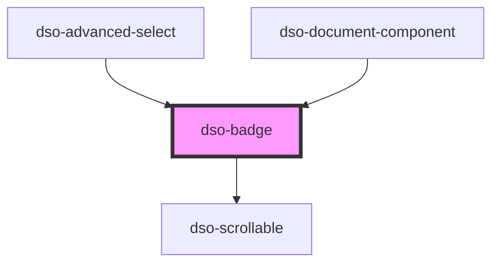

# `<dso-badge>`

<!-- Auto Generated Below -->

## Properties

| Property             | Attribute             | Description                                                                      | Type                                                                                                | Default     |
| -------------------- | --------------------- | -------------------------------------------------------------------------------- | --------------------------------------------------------------------------------------------------- | ----------- |
| `label`              | `label`               | The accessible name of the interactive Badge with Toggletip.                     | `string \| undefined`                                                                               | `undefined` |
| `status`             | `status`              | The status of the Badge.                                                         | `"attention" \| "error" \| "info" \| "outline" \| "primary" \| "success" \| "warning" \| undefined` | `undefined` |
| `toggletipPlacement` | `toggletip-placement` | The placement of the toggletip on click of the interactive Badge with Toggletip. | `"bottom" \| "left" \| "right" \| "top"`                                                            | `"top"`     |

## Slots

| Slot          | Description                                                                                                                                |
| ------------- | ------------------------------------------------------------------------------------------------------------------------------------------ |
|               | The message inside the badge.                                                                                                              |
| `"toggletip"` | An optional slot to place `Rich Content` in. When present the badge will be interactive (a button) and toggles a Tooltip with information. |

## Dependencies

### Used by

 - [dso-advanced-select](../advanced-select)
 - [dso-document-component](../document-component)

### Depends on

- [dso-scrollable](../scrollable)

### Graph

```mermaid
graph TD;
  dso-badge --> dso-scrollable
  dso-advanced-select --> dso-badge
  dso-document-component --> dso-badge
  style dso-badge fill:#f9f,stroke:#333,stroke-width:4px
```

----------------------------------------------

*Built with [StencilJS](https://stenciljs.com/)*
