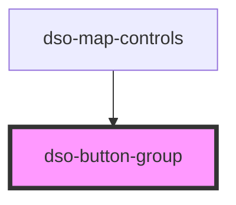

# `<dso-button-group>`

<!-- Auto Generated Below -->

## Properties

| Property    | Attribute   | Description                                                           | Type                | Default |
| ----------- | ----------- | --------------------------------------------------------------------- | ------------------- | ------- |
| `direction` | `direction` | The direction in which the buttons are displayed.  Defaults to `row`. | `"column" \| "row"` | `"row"` |

## Dependencies

### Used by

 - [dso-map-controls](../map-controls)

### Graph

----------------------------------------------

*Built with [StencilJS](https://stenciljs.com/)*
