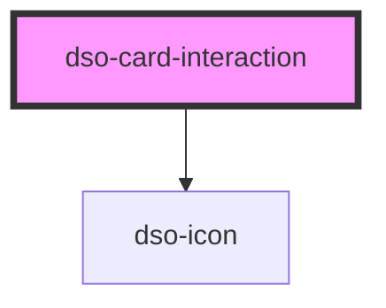

# dso-card-interaction

<!-- Auto Generated Below -->

## Properties

| Property             | Attribute | Description | Type     | Default     |
| -------------------- | --------- | ----------- | -------- | ----------- |
| `button`             | `button`  |             | `any`    | `undefined` |
| `label` _(required)_ | `label`   |             | `string` | `undefined` |
| `toggle`             | `toggle`  |             | `any`    | `undefined` |

## Dependencies

### Depends on

- [dso-icon](../icon)

### Graph

----------------------------------------------

*Built with [StencilJS](https://stenciljs.com/)*
