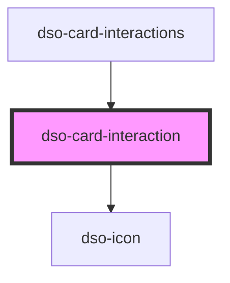

# dso-card-interaction

<!-- Auto Generated Below -->

## Properties

| Property   | Attribute  | Description | Type                  | Default     |
| ---------- | ---------- | ----------- | --------------------- | ----------- |
| `icon`     | `icon`     |             | `string \| undefined` | `undefined` |
| `label`    | `label`    |             | `string \| undefined` | `undefined` |
| `modifier` | `modifier` |             | `string \| undefined` | `undefined` |

## Dependencies

### Used by

 - [dso-card-interactions](../card-interactions)

### Depends on

- [dso-icon](../icon)

### Graph

----------------------------------------------

*Built with [StencilJS](https://stenciljs.com/)*
