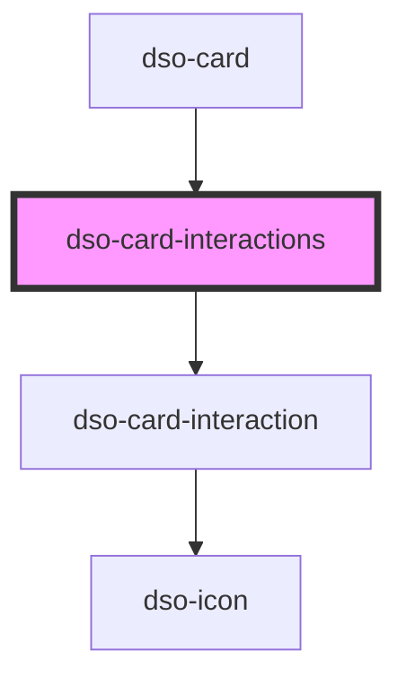

# `dso-card`, `dso-cards`, `dso-card-interaction`, `dso-card-interactions`

<!-- Auto Generated Below -->

## Properties

| Property             | Attribute      | Description | Type     | Default     |
| -------------------- | -------------- | ----------- | -------- | ----------- |
| `interactions`       | `interactions` |             | `any`    | `undefined` |
| `label` _(required)_ | `label`        |             | `string` | `undefined` |

## Dependencies

### Used by

 - [dso-card](.)

### Depends on

- [dso-card-interaction](.)

### Graph

----------------------------------------------

*Built with [StencilJS](https://stenciljs.com/)*
