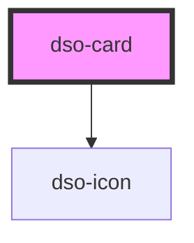

# dso-card

<!-- Auto Generated Below -->

## Properties

| Property     | Attribute     | Description                                                                                                                                                                                                                                                                       | Type                  | Default     |
| ------------ | ------------- | --------------------------------------------------------------------------------------------------------------------------------------------------------------------------------------------------------------------------------------------------------------------------------- | --------------------- | ----------- |
| `clickable`  | `clickable`   | **[DEPRECATED]** Use `href` instead and `<ELEMENT_TYPE slot="heading">` should NOT be of element type `a` (anchor).  Whether or not the Card is clickable. This is NOT a boolean attribute. Set to "false" to make the Card non-clickable. | `boolean`             | `true`      |
| `href`       | `href`        | The URL to which the Card heading links.                                                                                                                                                                                                                                          | `string \| undefined` | `undefined` |
| `imageShape` | `image-shape` | Presentation of image in header.  - "normal" ("24 x 24").  - "wide" ("30 x 26")                                                                                                                                                                                                   | `"normal" \| "wide"`  | `"normal"`  |

## Events

| Event            | Description                                                       | Type                               |
| ---------------- | ----------------------------------------------------------------- | ---------------------------------- |
| `dsoCardClicked` | Emitted when the Card is clickable and the user clicked the Card. | `CustomEvent<DsoCardClickedEvent>` |

## Dependencies

### Depends on

- [dso-icon](../icon)

### Graph

----------------------------------------------

*Built with [StencilJS](https://stenciljs.com/)*
