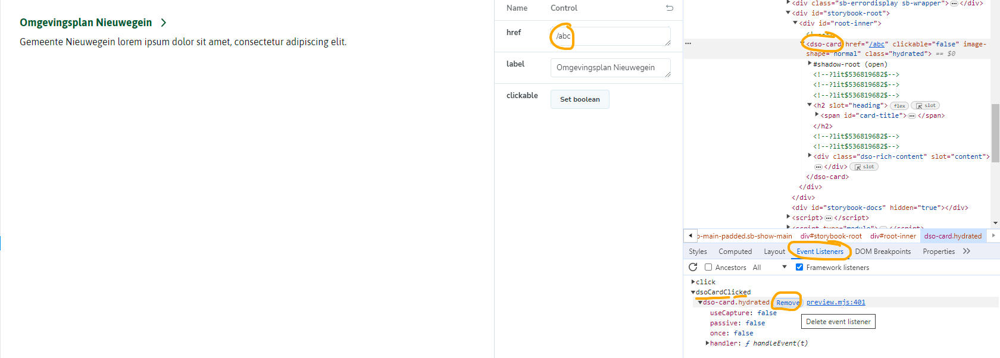
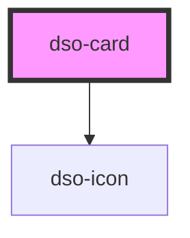

# <dso-card>

Beware: clicking the heading link with property `href` set doesn't navigate to the URL set. This is caused 
by the storybook implementation, which inhibits this normal behavior. Use developer tools to remove the Event 
Listener `dsoCardClicked` to enable the navigation to the set `href`

<!-- Auto Generated Below -->

## Properties

| Property            | Attribute | Description                                                                       | Type                   | Default     |
| ------------------- | --------- | --------------------------------------------------------------------------------- | ---------------------- | ----------- |
| `active`            | `active`  | Makes the Card active.                                                            | `boolean \| undefined` | `undefined` |
| `href` _(required)_ | `href`    | The URL to which the Card heading links.                                          | `string \| undefined`  | `undefined` |
| `mode`              | `mode`    | Display the link as an external link or a download link  - "download"  - "extern" | `string \| undefined`  | `undefined` |

## Events

| Event          | Description                               | Type                          |
| -------------- | ----------------------------------------- | ----------------------------- |
| `dsoCardClick` | Emitted when the Card heading is clicked. | `CustomEvent<CardClickEvent>` |

## Dependencies

### Depends on

- [dso-icon](../icon)

### Graph

----------------------------------------------

*Built with [StencilJS](https://stenciljs.com/)*
