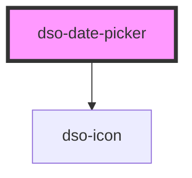

# dso-date-picker

<!-- Auto Generated Below -->

## Properties

| Property    | Attribute   | Description                                                                                                                                                                                                                    | Type                | Default   |
| ----------- | ----------- | ------------------------------------------------------------------------------------------------------------------------------------------------------------------------------------------------------------------------------ | ------------------- | --------- |
| `direction` | `direction` | Forces the opening direction of the calendar modal to be always left or right. This setting can be useful when the input is smaller than the opening date picker would be as by default the picker always opens towards right. | `"left" \| "right"` | `"right"` |
| `max`       | `max`       | Maximum date allowed to be picked. Must be in Dutch date format: DD-MM-YYYY. This setting can be used alone or together with the min property.                                                                                 | `string`            | `""`      |
| `min`       | `min`       | Minimum date allowed to be picked. Must be in Dutch date format: DD-MM-YYYY. This setting can be used alone or together with the max property.                                                                                 | `string`            | `""`      |

## Events

| Event       | Description                            | Type                                                                                            |
| ----------- | -------------------------------------- | ----------------------------------------------------------------------------------------------- |
| `dsoChange` | Event emitted when a date is selected. | `CustomEvent<{ component: "dso-date-picker"; valueAsDate: Date \| undefined; value: string; }>` |

## Methods

### `hide(moveFocusToButton?: boolean) => Promise<void>`

Hide the calendar modal. Set `moveFocusToButton` to false to prevent focus
returning to the date picker's button. Default is true.

#### Returns

Type: `Promise<void>`

### `show() => Promise<void>`

Show the calendar modal, moving focus to the calendar inside.

#### Returns

Type: `Promise<void>`

## Dependencies

### Depends on

- [dso-icon](../icon)

### Graph

----------------------------------------------

*Built with [StencilJS](https://stenciljs.com/)*
