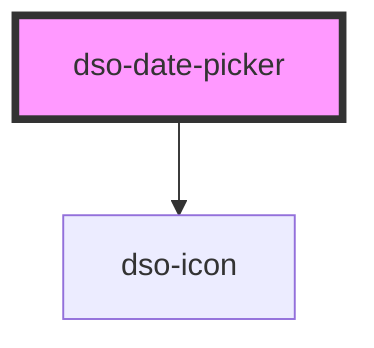

# `<dso-date-picker>`

Based on the [Duet Date Picker](https://duetds.github.io/date-picker/).

<!-- Auto Generated Below -->

## Properties

| Property       | Attribute       | Description                                                                                                                                                                                                                    | Type                  | Default     |
| -------------- | --------------- | ------------------------------------------------------------------------------------------------------------------------------------------------------------------------------------------------------------------------------ | --------------------- | ----------- |
| `direction`    | `direction`     | Forces the opening direction of the calendar modal to be always left or right. This setting can be useful when the input is smaller than the opening date picker would be as by default the picker always opens towards right. | `"left" \| "right"`   | `"right"`   |
| `disabled`     | `disabled`      | Makes the date picker input component disabled. This prevents users from being able to interact with the input, and conveys its inactive state to assistive technologies.                                                      | `boolean`             | `false`     |
| `dsoAutofocus` | `dso-autofocus` | Should the input be focused on load?                                                                                                                                                                                           | `boolean`             | `false`     |
| `identifier`   | `identifier`    | Adds a unique identifier for the date picker input. Use this instead of html `id` attribute.                                                                                                                                   | `string \| undefined` | `undefined` |
| `max`          | `max`           | Maximum date allowed to be picked. Must be in Dutch date format: DD-MM-YYYY. This setting can be used alone or together with the min property.                                                                                 | `string \| undefined` | `undefined` |
| `min`          | `min`           | Minimum date allowed to be picked. Must be in Dutch date format: DD-MM-YYYY. This setting can be used alone or together with the max property.                                                                                 | `string \| undefined` | `undefined` |
| `name`         | `name`          | Name of the date picker input.                                                                                                                                                                                                 | `string`              | `"date"`    |
| `required`     | `required`      | Should the input be marked as required?                                                                                                                                                                                        | `boolean`             | `false`     |
| `role`         | `role`          | Defines a specific role attribute for the date picker input.                                                                                                                                                                   | `string \| undefined` | `undefined` |
| `value`        | `value`         | Date value. Must be in Dutch date format: DD-MM-YYYY.                                                                                                                                                                          | `string`              | `""`        |

## Events

| Event           | Description                                         | Type                                                                                                                                                                        |
| --------------- | --------------------------------------------------- | --------------------------------------------------------------------------------------------------------------------------------------------------------------------------- |
| `dsoBlur`       | Event emitted the date picker input is blurred.     | `CustomEvent<{ component: "dso-date-picker"; }>`                                                                                                                            |
| `dsoDateChange` | Event emitted when a date is selected.              | `CustomEvent<{ component: "dso-date-picker"; valueAsDate: Date \| undefined; value: string; error?: "invalid" \| "required" \| "min-range" \| "max-range" \| undefined; }>` |
| `dsoFocus`      | Event emitted the date picker input is focused.     | `CustomEvent<{ component: "dso-date-picker"; }>`                                                                                                                            |
| `dsoKeyDown`    | Event emitted on key down in the date picker input. | `CustomEvent<{ component: "dso-date-picker"; originalEvent: KeyboardEvent; }>`                                                                                              |
| `dsoKeyUp`      | Event emitted on key up in the date picker input.   | `CustomEvent<{ component: "dso-date-picker"; originalEvent: KeyboardEvent; }>`                                                                                              |

## Methods

### `hide(moveFocusToButton?: boolean) => Promise<void>`

Hide the calendar modal. Set `moveFocusToButton` to false to prevent focus
returning to the date picker's button. Default is true.

#### Returns

Type: `Promise<void>`

### `setFocus() => Promise<void | undefined>`

Sets focus on the date picker's input. Use this method instead of the global `focus()`.

#### Returns

Type: `Promise<void | undefined>`

### `show() => Promise<void>`

Show the calendar modal, moving focus to the calendar inside.

#### Returns

Type: `Promise<void>`

## Dependencies

### Depends on

- [dso-icon](../icon)

### Graph

----------------------------------------------

*Built with [StencilJS](https://stenciljs.com/)*
