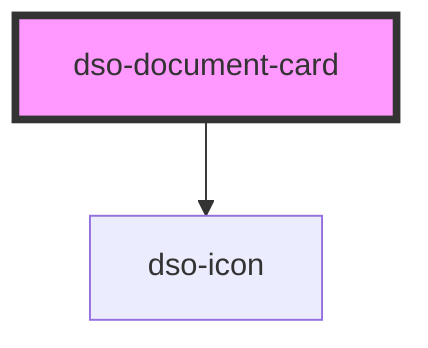

# `<dso-document-card>`

<!-- Auto Generated Below -->

## Properties

| Property            | Attribute | Description                                      | Type                   | Default     |
| ------------------- | --------- | ------------------------------------------------ | ---------------------- | ----------- |
| `active`            | `active`  | Makes the DocumentCard active.                   | `boolean \| undefined` | `undefined` |
| `href` _(required)_ | `href`    | The URL to which the DocumentCard heading links. | `string \| undefined`  | `undefined` |

## Events

| Event                  | Description                                       | Type                                  |
| ---------------------- | ------------------------------------------------- | ------------------------------------- |
| `dsoDocumentCardClick` | Emitted when the DocumentCard heading is clicked. | `CustomEvent<DocumentCardClickEvent>` |

## Slots

| Slot        | Description                                                                    |
| ----------- | ------------------------------------------------------------------------------ |
| `"heading"` | A slot to place the title of the card in.                                      |
| `"status"`  | A slot to hold an optional Label and some status information on the document.* |
| `"type"`    | A slot to hold type of document with an optional `Toggletip`.                  |

## Dependencies

### Depends on

- [dso-icon](../icon)

### Graph

----------------------------------------------

*Built with [StencilJS](https://stenciljs.com/)*
