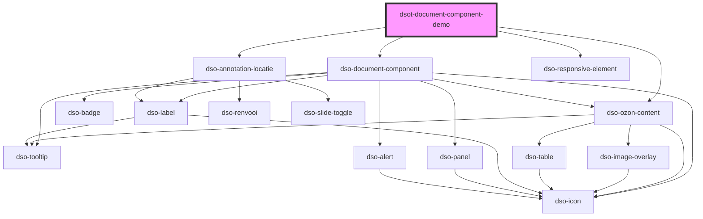

# `<dsot-document-component-demo>`

<!-- Auto Generated dso-toolkit -->

## Types

### DocumentComponentMode

```typescript
export type DocumentComponentMode = "document" | "table-of-contents";
```

<!-- src/components/document-component/document-component.models.ts::DocumentComponentMode -->

### DocumentComponentOzonContentAnchorClickEvent

```typescript
export interface DocumentComponentOzonContentAnchorClickEvent {
  originalEvent: DsoOzonContentCustomEvent<OzonContentAnchorClickEvent>;
  ozonContentAnchorClick: OzonContentAnchorClickEvent;
}
```

<!-- src/components/document-component/document-component.models.ts::DocumentComponentOzonContentAnchorClickEvent -->

### DocumentComponentTableOfContentsClickEvent

```typescript
export interface DocumentComponentTableOfContentsClickEvent {
  originalEvent: MouseEvent;
  /** True when user clicked the document component heading while holding Ctrl, Alt or other modifiers, or when the document component heading is right-clicked. Can be used to determine navigation. */
  isModifiedEvent: boolean;
}
```

<!-- src/components/document-component/document-component.models.ts::DocumentComponentTableOfContentsClickEvent -->

### OzonContentUrlResolver

```typescript
any;
```

<!-- src/components.d.ts::OzonContentUrlResolver -->

<!-- Auto Generated Below -->

## Properties

| Property                 | Attribute                   | Description                                                                                                     | Type                                  | Default      |
| ------------------------ | --------------------------- | --------------------------------------------------------------------------------------------------------------- | ------------------------------------- | ------------ |
| `jsonFile`               | `json-file`                 | Name of the file to load.                                                                                       | `string \| undefined`                 | `undefined`  |
| `mode`                   | `mode`                      | The mode of the Document Component. One of "document" or "table-of-contents". Defaults to "document"            | `"document" \| "table-of-contents"`   | `"document"` |
| `openDefault`            | `open-default`              | The default state for all Document Components.                                                                  | `boolean`                             | `false`      |
| `ozonContentUrlResolver` | `ozon-content-url-resolver` | A UrlResolver that will be called for all STOP elements that render to HTML5 elements with external references. | `OzonContentUrlResolver \| undefined` | `undefined`  |
| `showCanvas`             | `show-canvas`               | Show canvas to where Document Component extends.                                                                | `boolean`                             | `false`      |

## Events

| Event                        | Description                                                       | Type                                                        |
| ---------------------------- | ----------------------------------------------------------------- | ----------------------------------------------------------- |
| `dsotOzonContentAnchorClick` | To demo user interacting with IntRef or IntIoRef elements.        | `CustomEvent<DocumentComponentOzonContentAnchorClickEvent>` |
| `dsotTableOfContentsClick`   | To demo user interacting the heading in mode="table-of-contents". | `CustomEvent<DocumentComponentTableOfContentsClickEvent>`   |

## Dependencies

### Depends on

- [dso-document-component](../document-component)
- [dso-annotation-locatie](../annotation/annotation-locatie)
- [dso-ozon-content](../ozon-content)
- [dso-responsive-element](../responsive-element)

### Graph



---

_Built with [StencilJS](https://stenciljs.com/)_
