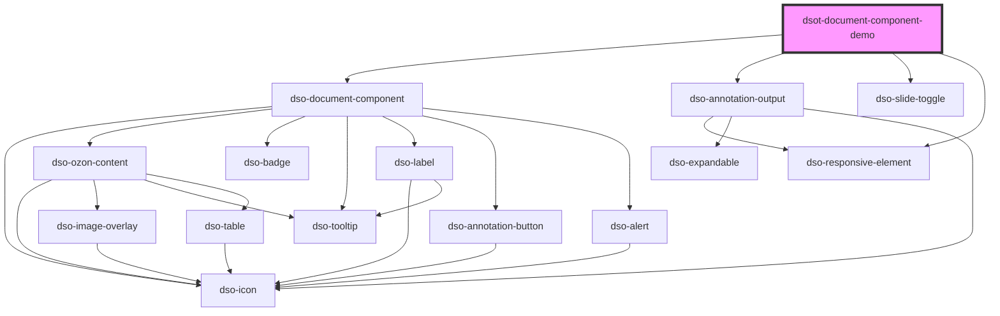

# dsot-document-component-demo

<!-- Auto Generated Below -->

## Properties

| Property      | Attribute      | Description                                      | Type                  | Default     |
| ------------- | -------------- | ------------------------------------------------ | --------------------- | ----------- |
| `jsonFile`    | `json-file`    | Name of the file to load.                        | `string \| undefined` | `undefined` |
| `openDefault` | `open-default` | The default state for all Document Components.   | `boolean`             | `false`     |
| `showCanvas`  | `show-canvas`  | Show canvas to where Document Component extends. | `boolean`             | `false`     |

## Events

| Event                        | Description                                                | Type                                                        |
| ---------------------------- | ---------------------------------------------------------- | ----------------------------------------------------------- |
| `dsotOzonContentAnchorClick` | To demo user interacting with IntRef or IntIoRef elements. | `CustomEvent<DocumentComponentOzonContentAnchorClickEvent>` |

## Dependencies

### Depends on

- [dso-document-component](../document-component)
- [dso-annotation-output](../annotation-output)
- [dso-slide-toggle](../slide-toggle)
- [dso-responsive-element](../responsive-element)

### Graph

----------------------------------------------

*Built with [StencilJS](https://stenciljs.com/)*
