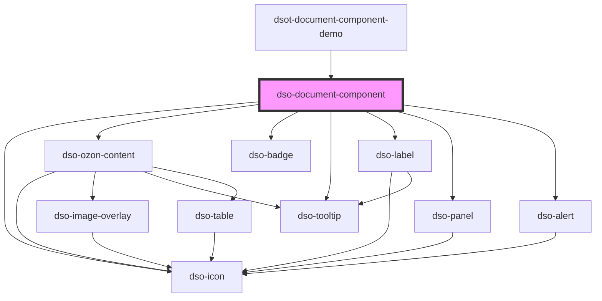

# `<dso-document-component>`

<!-- Auto Generated Below -->

## Properties

| Property                   | Attribute                    | Description                                                                                                       | Type                                                                                  | Default      |
| -------------------------- | ---------------------------- | ----------------------------------------------------------------------------------------------------------------- | ------------------------------------------------------------------------------------- | ------------ |
| `alternativeTitle`         | `alternative-title`          | An alternative title to show when there is nothing to create a title.                                             | `string \| undefined`                                                                 | `undefined`  |
| `annotated`                | `annotated`                  | Enables annotations.                                                                                              | `boolean`                                                                             | `false`      |
| `annotationsWijzigactie`   | `annotations-wijzigactie`    | The wijzigactie for all annotations.                                                                              | `"verwijder" \| "voegtoe" \| undefined`                                               | `undefined`  |
| `bevatOntwerpInformatie`   | `bevat-ontwerp-informatie`   | Marks as draft.                                                                                                   | `boolean`                                                                             | `false`      |
| `filtered`                 | `filtered`                   | Marks this Document Component as belonging to an active filter.                                                   | `boolean`                                                                             | `false`      |
| `genesteOntwerpInformatie` | `geneste-ontwerp-informatie` | When a child Document Component has a status "Draft".                                                             | `boolean`                                                                             | `false`      |
| `gereserveerd`             | `gereserveerd`               | Marks Document Component as reserved.                                                                             | `boolean`                                                                             | `false`      |
| `heading`                  | `heading`                    | The heading element to use.                                                                                       | `"h2" \| "h3" \| "h4" \| "h5" \| "h6"`                                                | `"h2"`       |
| `href`                     | `href`                       | The URL to which the Heading links (only in mode="table-of-contents").                                            | `string \| undefined`                                                                 | `undefined`  |
| `inhoud`                   | `inhoud`                     | The Inhoud XML.                                                                                                   | `XMLDocument \| string \| undefined`                                                  | `undefined`  |
| `label`                    | `label`                      | The Label XML.                                                                                                    | `XMLDocument \| string \| undefined`                                                  | `undefined`  |
| `mark`                     | --                           | To mark text.                                                                                                     | `((text: string, source: DocumentComponentSource) => OzonContentText[]) \| undefined` | `undefined`  |
| `mode`                     | `mode`                       | The mode of the Document Component. One of "document" or "table-of-contents". Defaults to "document"              | `"document" \| "table-of-contents"`                                                   | `"document"` |
| `notApplicable`            | `not-applicable`             | Marks this Document Component as not-applicable.                                                                  | `boolean`                                                                             | `false`      |
| `nummer`                   | `nummer`                     | The Nummer XML.                                                                                                   | `XMLDocument \| string \| undefined`                                                  | `undefined`  |
| `open`                     | `open`                       | This boolean attribute indicates whether the children are visible.                                                | `boolean`                                                                             | `false`      |
| `openAnnotation`           | `open-annotation`            | When the Annotation is opened, set this to true.                                                                  | `boolean`                                                                             | `false`      |
| `opschrift`                | `opschrift`                  | The Opschrift XML.                                                                                                | `XMLDocument \| string \| undefined`                                                  | `undefined`  |
| `recursiveToggle`          | `recursive-toggle`           | Shows the recursive toggle button. When the user activates this button the event `dsoRecursiveToggle` is emitted. | `"indeterminate" \| boolean \| undefined`                                             | `undefined`  |
| `type`                     | `type`                       | Type of Document Component.                                                                                       | `string \| undefined`                                                                 | `undefined`  |
| `vervallen`                | `vervallen`                  | Marks the Document Component as expired.                                                                          | `boolean`                                                                             | `false`      |
| `wijzigactie`              | `wijzigactie`                | The wijzigactie as in STOP.                                                                                       | `"nieuweContainer" \| "verwijder" \| "verwijderContainer" \| "voegtoe" \| undefined`  | `undefined`  |

## Events

| Event                       | Description                                                              | Type                                                        |
| --------------------------- | ------------------------------------------------------------------------ | ----------------------------------------------------------- |
| `dsoAnnotationToggle`       | Emitted when the user activates the annotation button.                   | `CustomEvent<DocumentComponentToggleAnnotationEvent>`       |
| `dsoMarkItemHighlight`      | Emitted each time a marked item gets highlighted.                        | `CustomEvent<DocumentComponentMarkItemHighlightEvent>`      |
| `dsoOpenToggle`             | Emitted when the user activates the toggle.                              | `CustomEvent<DocumentComponentOpenToggleEvent>`             |
| `dsoOzonContentAnchorClick` | Emitted when the user actives intRef or intIoRef anchors in Ozon Content | `CustomEvent<DocumentComponentOzonContentAnchorClickEvent>` |
| `dsoRecursiveToggle`        | Emitted when the user activates the recursive toggle.                    | `CustomEvent<DocumentComponentRecursiveToggleEvent>`        |
| `dsoTableOfContentsClick`   | Emitted when the user clicks the heading in mode="table-of-contents".    | `CustomEvent<DocumentComponentTableOfContentsClickEvent>`   |

## Shadow Parts

| Part                      | Description                 |
| ------------------------- | --------------------------- |
| `"_annotation-container"` | private part, do not touch. |
| `"_children-container"`   | private part, do not touch. |
| `"_content"`              | private part, do not touch. |
| `"_heading-container"`    | private part, do not touch. |

## Dependencies

### Used by

 - [dsot-document-component-demo](../document-component-demo)

### Depends on

- [dso-icon](../icon)
- [dso-ozon-content](../ozon-content)
- [dso-badge](../badge)
- [dso-tooltip](../tooltip)
- [dso-label](../label)
- [dso-panel](../panel)
- [dso-alert](../alert)

### Graph

----------------------------------------------

*Built with [StencilJS](https://stenciljs.com/)*
