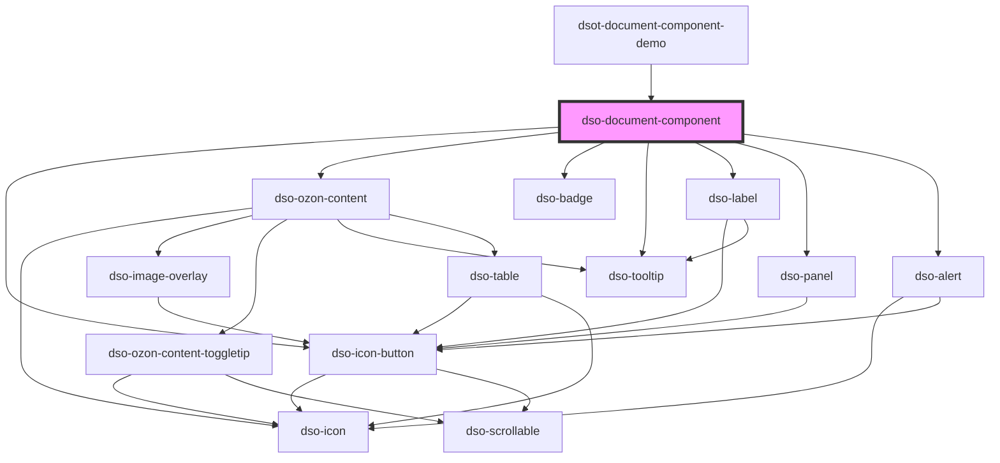

# `<dso-document-component>`

<!-- Auto Generated Below -->

## Properties

| Property                    | Attribute                 | Description                                                                                                                                                                                               | Type                                                                                                                                           | Default      |
| --------------------------- | ------------------------- | --------------------------------------------------------------------------------------------------------------------------------------------------------------------------------------------------------- | ---------------------------------------------------------------------------------------------------------------------------------------------- | ------------ |
| `alternativeTitle`          | `alternative-title`       | An alternative title to show when there is nothing to create a title.                                                                                                                                     | `string \| undefined`                                                                                                                          | `undefined`  |
| `annotated`                 | `annotated`               | Enables annotations.                                                                                                                                                                                      | `boolean`                                                                                                                                      | `false`      |
| `annotationsWijzigactie`    | `annotations-wijzigactie` | The wijzigactie for all annotations.                                                                                                                                                                      | `"verwijder" \| "voegtoe" \| undefined`                                                                                                        | `undefined`  |
| `badge`                     | `badge`                   | Text to display in the badge (e.g. "!").                                                                                                                                                                  | `string \| undefined`                                                                                                                          | `undefined`  |
| `badgeStatus`               | `badge-status`            | Status/color of the badge.                                                                                                                                                                                | `"attention" \| "error" \| "info" \| "outline" \| "primary" \| "success" \| "warning" \| undefined`                                            | `undefined`  |
| `badgeTooltip`              | `badge-tooltip`           | Tooltip text for the badge.                                                                                                                                                                               | `string \| undefined`                                                                                                                          | `undefined`  |
| `filtered`                  | `filtered`                | Marks this Document Component as belonging to an active filter.                                                                                                                                           | `boolean`                                                                                                                                      | `false`      |
| `gereserveerd`              | `gereserveerd`            | Marks Document Component as reserved.                                                                                                                                                                     | `XMLDocument \| string \| undefined`                                                                                                           | `undefined`  |
| `heading`                   | `heading`                 | The heading element to use.                                                                                                                                                                               | `"h2" \| "h3" \| "h4" \| "h5" \| "h6"`                                                                                                         | `"h2"`       |
| `href`                      | `href`                    | The URL to which the Heading links (only in mode="table-of-contents").                                                                                                                                    | `string \| undefined`                                                                                                                          | `undefined`  |
| `inhoud`                    | `inhoud`                  | The Inhoud XML.                                                                                                                                                                                           | `XMLDocument \| string \| undefined`                                                                                                           | `undefined`  |
| `kop`                       | `kop`                     | The Kop XML.                                                                                                                                                                                              | `XMLDocument \| string \| undefined`                                                                                                           | `undefined`  |
| `label`                     | `label`                   | Text to display in the label (e.g. "Ontwerp", "Besluitversie").                                                                                                                                           | `string \| undefined`                                                                                                                          | `undefined`  |
| `labelStatus`               | `label-status`            | Status/color of the label.                                                                                                                                                                                | `"attention" \| "bright" \| "error" \| "filter" \| "info" \| "primary" \| "success" \| "toegevoegd" \| "verwijderd" \| "warning" \| undefined` | `undefined`  |
| `mark`                      | --                        | To mark text.                                                                                                                                                                                             | `((text: string, source: DocumentComponentSource) => MarkTextText[]) \| undefined`                                                             | `undefined`  |
| `mode`                      | `mode`                    | The mode of the Document Component. One of "document" or "table-of-contents". Defaults to "document"                                                                                                      | `"document" \| "table-of-contents"`                                                                                                            | `"document"` |
| `notApplicable`             | `not-applicable`          | Marks this Document Component as not-applicable.                                                                                                                                                          | `boolean`                                                                                                                                      | `false`      |
| `open`                      | `open`                    | This boolean attribute indicates whether the children are visible.                                                                                                                                        | `boolean`                                                                                                                                      | `false`      |
| `openAnnotation`            | `open-annotation`         | When the Annotation is opened, set this to true.                                                                                                                                                          | `boolean`                                                                                                                                      | `false`      |
| `ozonContentBegripResolver` | --                        | A BegripResolver that will be called for STOP element "IntRef". If the ref-attribute of IntRef points to a Begrip it should return the `<Definitie>` of that Begrip otherwise it should return undefined. | `OzonContentBegripResolver \| undefined`                                                                                                       | `undefined`  |
| `ozonContentUrlResolver`    | --                        | A UrlResolver that will be called for all STOP elements that render to HTML5 elements with external references.                                                                                           | `OzonContentUrlResolver \| undefined`                                                                                                          | `undefined`  |
| `recursiveToggle`           | `recursive-toggle`        | Shows the recursive toggle button. When the user activates this button the event `dsoRecursiveToggle` is emitted.                                                                                         | `"indeterminate" \| boolean \| undefined`                                                                                                      | `undefined`  |
| `type`                      | `type`                    | Type of Document Component.                                                                                                                                                                               | `string \| undefined`                                                                                                                          | `undefined`  |
| `vervallen`                 | `vervallen`               | Marks the Document Component as expired.                                                                                                                                                                  | `XMLDocument \| string \| undefined`                                                                                                           | `undefined`  |
| `wijzigactie`               | `wijzigactie`             | The wijzigactie as in STOP.                                                                                                                                                                               | `"nieuweContainer" \| "verwijder" \| "verwijderContainer" \| "voegtoe" \| undefined`                                                           | `undefined`  |

## Events

| Event                     | Description                                                                                                   | Type                                                      |
| ------------------------- | ------------------------------------------------------------------------------------------------------------- | --------------------------------------------------------- |
| `dsoAnnotationToggle`     | Emitted when the user activates the annotation button.                                                        | `CustomEvent<DocumentComponentToggleAnnotationEvent>`     |
| `dsoMarkItemHighlight`    | Emitted each time a marked item gets highlighted.                                                             | `CustomEvent<DocumentComponentMarkItemHighlightEvent>`    |
| `dsoOpenToggle`           | Emitted when the user activates the toggle.                                                                   | `CustomEvent<DocumentComponentOpenToggleEvent>`           |
| `dsoOzonContentClick`     | Emitted when the user interacts with Kop, IntRef or the Kenmerken en kaart button of IntIoRef in Ozon Content | `CustomEvent<DocumentComponentOzonContentClickEvent>`     |
| `dsoRecursiveToggle`      | Emitted when the user activates the recursive toggle.                                                         | `CustomEvent<DocumentComponentRecursiveToggleEvent>`      |
| `dsoTableOfContentsClick` | Emitted when the user clicks the heading in mode="table-of-contents".                                         | `CustomEvent<DocumentComponentTableOfContentsClickEvent>` |

## Shadow Parts

| Part                      | Description                 |
| ------------------------- | --------------------------- |
| `"_annotation-container"` | private part, do not touch. |
| `"_children-container"`   | private part, do not touch. |
| `"_content"`              | private part, do not touch. |
| `"_heading-container"`    | private part, do not touch. |

## Dependencies

### Used by

 - [dsot-document-component-demo](../document-component-demo)

### Depends on

- [dso-icon-button](../icon-button)
- [dso-ozon-content](../ozon-content)
- [dso-badge](../badge)
- [dso-tooltip](../tooltip)
- [dso-label](../label)
- [dso-panel](../panel)
- [dso-alert](../alert)

### Graph

----------------------------------------------

*Built with [StencilJS](https://stenciljs.com/)*
