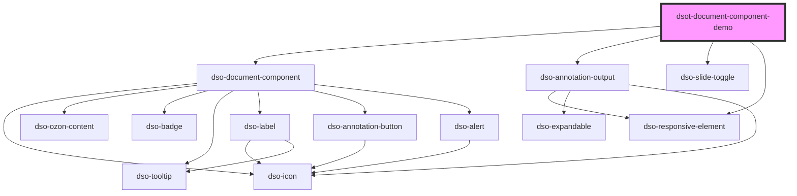

# dso-document-component

<!-- Auto Generated Below -->

## Dependencies

### Depends on

- [dso-document-component](.)
- [dso-annotation-output](../annotation-output)
- [dso-slide-toggle](../slide-toggle)
- [dso-responsive-element](../responsive-element)

### Graph

----------------------------------------------

*Built with [StencilJS](https://stenciljs.com/)*
