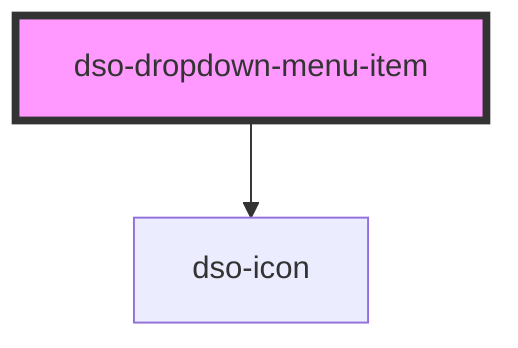

# `<dso-dropdown-menu-item>`

<!-- Auto Generated Below -->

## Properties

| Property            | Attribute | Description                                                           | Type                              | Default     |
| ------------------- | --------- | --------------------------------------------------------------------- | --------------------------------- | ----------- |
| `checked`           | `checked` | Whether the Dropdown Menu Item is checked.                            | `boolean \| undefined`            | `undefined` |
| `href`              | `href`    | The href of the link when the type is `link`.                         | `string \| undefined`             | `undefined` |
| `type` _(required)_ | `type`    | The type of the dropdown menu item. Can be one of `button` or `link`. | `"button" \| "link" \| undefined` | `undefined` |

## Events

| Event      | Description                                          | Type                                      |
| ---------- | ---------------------------------------------------- | ----------------------------------------- |
| `dsoClick` | Emitted when the user clicks the Dropdown Menu Item. | `CustomEvent<DropdownMenuItemClickEvent>` |

## Dependencies

### Depends on

- [dso-icon](../../icon)

### Graph

----------------------------------------------

*Built with [StencilJS](https://stenciljs.com/)*
