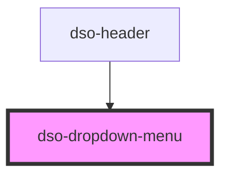

# `<dso-dropdown-menu>`

Must contain one `button` element with `slot="toggle"`.

Must contain one `.dso-dropdown-options` containing one or more `ul` elements with tabbable elements (`a` or `button`) inside.

Items can be marked as "checked" by adding the attribute `checkable` and adding the `dso-checked` class to `<li>`.

<!-- Auto Generated dso-toolkit -->

## Types

### Placement

```typescript
any;
```

<!-- ../../node_modules/@popperjs/core/index.d.ts::Placement -->

<!-- Auto Generated Below -->

## Properties

| Property                | Attribute                 | Description                                                                  | Type                                                                                                                                                                                                                      | Default     |
| ----------------------- | ------------------------- | ---------------------------------------------------------------------------- | ------------------------------------------------------------------------------------------------------------------------------------------------------------------------------------------------------------------------- | ----------- |
| `boundary`              | `boundary`                | Selector for the element the dropdown options should not be overflowing.     | `string \| undefined`                                                                                                                                                                                                     | `undefined` |
| `checkable`             | `checkable`               | Whether the menu is checkable.                                               | `boolean`                                                                                                                                                                                                                 | `false`     |
| `dropdownAlign`         | `dropdown-align`          | Alignment of the dropdown                                                    | `"left" \| "right"`                                                                                                                                                                                                       | `"left"`    |
| `dropdownOptionsOffset` | `dropdown-options-offset` | Space between button and dropdown options                                    | `number`                                                                                                                                                                                                                  | `2`         |
| `open`                  | `open`                    | Whether the menu is open or closed. This attribute is reflected and mutable. | `boolean`                                                                                                                                                                                                                 | `false`     |
| `placement`             | `placement`               | Force placement of dropdown. This property overrides `dropdownAlign`.        | `"auto" \| "auto-end" \| "auto-start" \| "bottom" \| "bottom-end" \| "bottom-start" \| "left" \| "left-end" \| "left-start" \| "right" \| "right-end" \| "right-start" \| "top" \| "top-end" \| "top-start" \| undefined` | `undefined` |
| `strategy`              | `strategy`                | Set position strategy of dropdown options                                    | `"absolute" \| "auto" \| "fixed"`                                                                                                                                                                                         | `"auto"`    |

## Dependencies

### Used by

- [dso-header](../header)

### Graph



---

_Built with [StencilJS](https://stenciljs.com/)_
