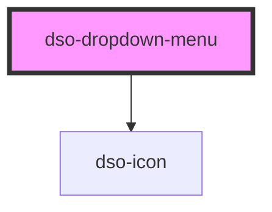

# `<dso-dropdown-menu>`

Must contain one `button` element with `slot="toggle"`.

Must contain one `.dso-dropdown-options` containing one or more `ul` elements with tabbable elements (`a` or `button`) inside.

Items can be marked as "checked" by adding the attribute `checkable` and adding the `dso-checked` class to `<li>`.

<!-- Auto Generated Below -->

## Properties

| Property    | Attribute   | Description                                  | Type                                     | Default       |
| ----------- | ----------- | -------------------------------------------- | ---------------------------------------- | ------------- |
| `checkable` | `checkable` | Whether the menu items are checkable.        | `boolean`                                | `undefined`   |
| `label`     | `label`     | The label of the Dropdown Menu Button        | `string \| undefined`                    | `undefined`   |
| `variant`   | `variant`   | The variant of the Button to toggle the menu | `"primary" \| "secondary" \| "tertiary"` | `"secondary"` |

## Dependencies

### Depends on

- [dso-icon](../icon)

### Graph

```mermaid
graph TD;
  dso-dropdown-menu --> dso-icon
  style dso-dropdown-menu fill:#f9f,stroke:#333,stroke-width:4px
```

----------------------------------------------

*Built with [StencilJS](https://stenciljs.com/)*
