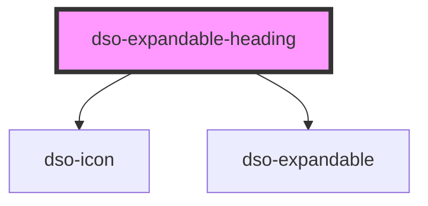

# `<dso-expandable-heading>`

<!-- Auto Generated Below -->

## Properties

| Property  | Attribute | Description | Type                                   | Default     |
| --------- | --------- | ----------- | -------------------------------------- | ----------- |
| `color`   | `color`   |             | `"black" \| "default"`                 | `"default"` |
| `heading` | `heading` |             | `"h2" \| "h3" \| "h4" \| "h5" \| "h6"` | `"h2"`      |
| `open`    | `open`    |             | `boolean \| undefined`                 | `undefined` |

## Dependencies

### Depends on

- [dso-icon](../icon)
- [dso-expandable](../expandable)

### Graph

----------------------------------------------

*Built with [StencilJS](https://stenciljs.com/)*
