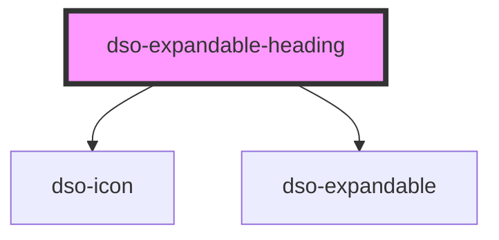

# `<dso-expandable-heading>`

<!-- Auto Generated Below -->

## Properties

| Property     | Attribute     | Description                                                                               | Type                                   | Default     |
| ------------ | ------------- | ----------------------------------------------------------------------------------------- | -------------------------------------- | ----------- |
| `color`      | `color`       | The color.                                                                                | `"black" \| "default"`                 | `"default"` |
| `editAction` | `edit-action` | Whether this Expandable Heading has an edit action.  Also known as "wijzigactie" in STOP. | `"delete" \| "insert" \| undefined`    | `undefined` |
| `heading`    | `heading`     | Which heading element to use.                                                             | `"h2" \| "h3" \| "h4" \| "h5" \| "h6"` | `"h2"`      |
| `open`       | `open`        | To open the Expandable Heading.                                                           | `boolean \| undefined`                 | `undefined` |

## Events

| Event       | Description                                        | Type                                        |
| ----------- | -------------------------------------------------- | ------------------------------------------- |
| `dsoToggle` | Emitted when the user activates the toggle button. | `CustomEvent<ExpandableHeadingToggleEvent>` |

## Dependencies

### Depends on

- [dso-icon](../icon)
- [dso-expandable](../expandable)

### Graph

----------------------------------------------

*Built with [StencilJS](https://stenciljs.com/)*
