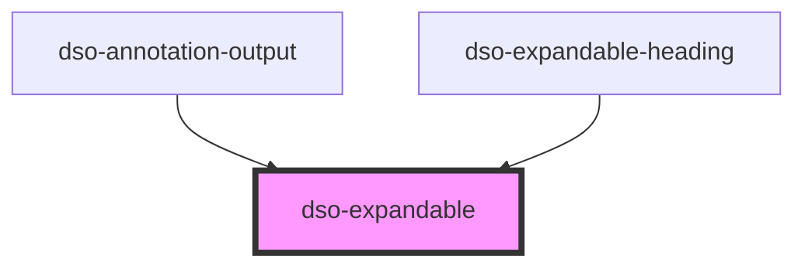

# `<dso-expandable>`

<!-- Auto Generated Below -->

## Properties

| Property | Attribute | Description | Type                   | Default     |
| -------- | --------- | ----------- | ---------------------- | ----------- |
| `open`   | `open`    |             | `boolean \| undefined` | `undefined` |

## Dependencies

### Used by

 - [dso-annotation-output](../annotation-output)
 - [dso-expandable-heading](../expandable-heading)

### Graph

----------------------------------------------

*Built with [StencilJS](https://stenciljs.com/)*
