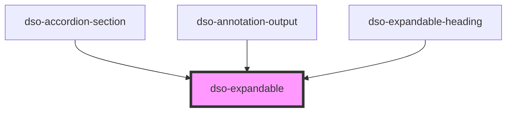

# `<dso-expandable>`

<!-- Auto Generated Below -->

## Properties

| Property          | Attribute          | Description | Type                   | Default     |
| ----------------- | ------------------ | ----------- | ---------------------- | ----------- |
| `animationOffset` | `animation-offset` |             | `number \| undefined`  | `undefined` |
| `enableAnimation` | `enable-animation` |             | `boolean`              | `false`     |
| `open`            | `open`             |             | `boolean \| undefined` | `undefined` |

## Events

| Event       | Description | Type                                 |
| ----------- | ----------- | ------------------------------------ |
| `dsoToggle` |             | `CustomEvent<ExpandableToggleEvent>` |

## Methods

### `getAnimeInstance() => Promise<anime.AnimeInstance | undefined>`

#### Returns

Type: `Promise<AnimeInstance | undefined>`

## Dependencies

### Used by

 - [dso-accordion-section](../accordion/components)
 - [dso-annotation-output](../annotation-output)
 - [dso-expandable-heading](../expandable-heading)

### Graph

----------------------------------------------

*Built with [StencilJS](https://stenciljs.com/)*
