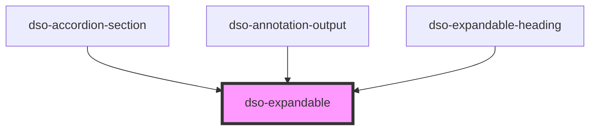

# `<dso-expandable>`

<!-- Auto Generated Below -->

## Properties

| Property          | Attribute          | Description                                                                                                                                     | Type                   | Default     |
| ----------------- | ------------------ | ----------------------------------------------------------------------------------------------------------------------------------------------- | ---------------------- | ----------- |
| `enableAnimation` | `enable-animation` |                                                                                                                                                 | `boolean`              | `false`     |
| `minimumHeight`   | `minimum-height`   | When enableAnimation is set to `true`, this property specifies the height of this element at which the animation will expand from / collapse to | `number \| undefined`  | `undefined` |
| `open`            | `open`             |                                                                                                                                                 | `boolean \| undefined` | `undefined` |

## Events

| Event                   | Description | Type                                 |
| ----------------------- | ----------- | ------------------------------------ |
| `animationInstantiated` |             | `CustomEvent<void>`                  |
| `dsoToggle`             |             | `CustomEvent<ExpandableToggleEvent>` |

## Methods

### `getAnimeInstance() => Promise<AnimeInstance | undefined>`

#### Returns

Type: `Promise<AnimeInstance | undefined>`

### `getBodyHeight() => Promise<number | undefined>`

#### Returns

Type: `Promise<number | undefined>`

## Dependencies

### Used by

 - [dso-accordion-section](../accordion/components)
 - [dso-annotation-output](../annotation-output)
 - [dso-expandable-heading](../expandable-heading)

### Graph

----------------------------------------------

*Built with [StencilJS](https://stenciljs.com/)*
